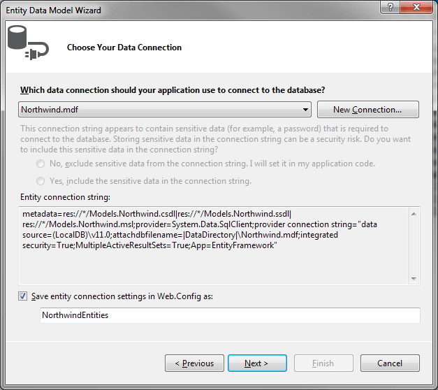
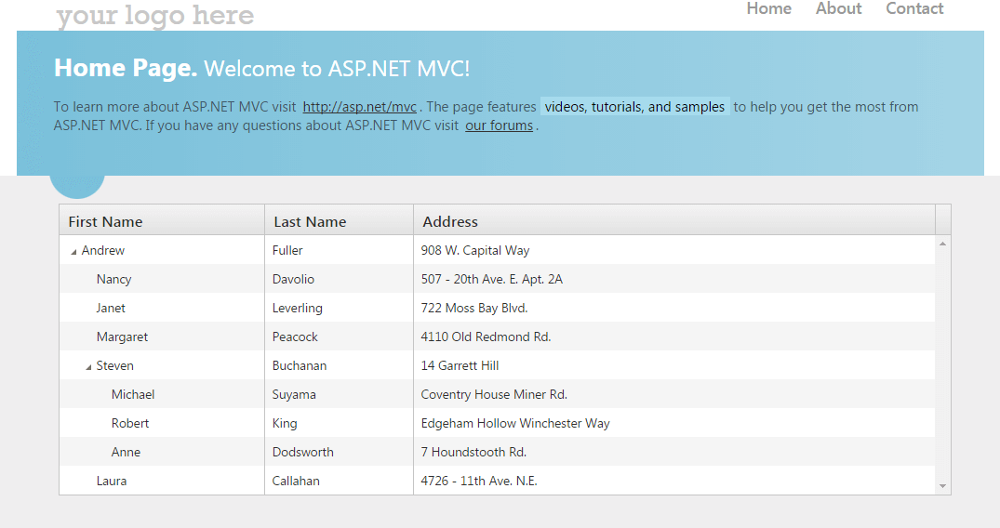

# TreeList HtmlHelper Overview

The Telerik UI TreeList HtmlHelper for {{ site.framework }} is a server-side wrapper for the Kendo UI TreeList widget.

The TreeList enables the display of self-referencing tabular data and allows sorting, filtering, and data editing.

* [Demo page for the TreeList](https://demos.telerik.com/{{ site.platform }}/treelist/index)

## Initializing the TreeList

The following example demonstrates how to define the TreeList by using the TreeList HtmlHelper.

> The TreeList HtmlHelper distinguishes the root items based on the `ParentId` field. If the `ParentId` is set as `.Nullable(true)`, root items with be items whose `ParentId` field values are `null`. If the `ParentId` is not nullable (`.Nullable(false)`), root items will be items which have a default value for their data type.


1. Create a new ASP.NET MVC application. If you have installed the [Telerik UI for ASP.NET MVC Visual Studio Extensions](), create a Telerik UI for ASP.NET MVC application. Name the application `KendoGridServerBinding`. If you decided not to use the Telerik UI for ASP.NET MVC Visual Studio Extensions, follow the steps from the [introductory article]() to add Telerik UI for ASP.NET MVC to the application.
1. Add a new `Entity Framework Data Model`. Right-click the `~/Models` folder in the solution explorer and pick **Add new item**. Choose **Data** > **ADO.NET Entity Data Model** in the **Add New Item** dialog. Name the model `Northwind.edmx` and click **Next**. This starts the **Entity Data Model Wizard**.

    

1. Pick the **Generate from database** option and click **Next**. Configure a connection to the Northwind database. Click **Next**.

    

1. Choose the **Employees** table from the `Which database objects do you want to include in your model?`. Leave all other options as they are set by default. Click **Finish**.

    

1. Right-click the `~/Models` folder in the solution explorer and add a new `EmployeeViewModel` class.


```Model
    public class EmployeeViewModel
    {
        // The Id.
        public int EmployeeID { get; set; }

        public string FirstName { get; set; }

        public string LastName { get; set; }

        // A nullable ParentId.
        public int? ReportsTo { get; set; }

        public string Address { get; set; }

        // This is a case-sensitive property. Define it only if you want to use lazy-loading.
        // If it is not defined, the TreeList will calculate and assign its value on the client.
        public bool hasChildren { get; set; }
    }
```
```Controller
 public JsonResult All([DataSourceRequest] DataSourceRequest request)
    {
        var result = GetDirectory().ToTreeDataSourceResult(request,
            e => e.EmployeeId,
            e => e.ReportsTo,
            e => e
        );

        return Json(result, JsonRequestBehavior.AllowGet);
    }
```
```AsyncController  
    public async Task<JsonResult> TreeList_Read([DataSourceRequest] DataSourceRequest request)
    {
        var northwind = new NortwindEntities();

        var result = await northwind.Employees.ToTreeDataSourceResultAsync(request,
            employee => employee.EmployeeID,
            employee => employee.ReportsTo,
            employee => e
        );

        return Json(result, JsonRequestBehavior.AllowGet);
    }

```
```Razor
@(Html.Kendo().TreeList<Kendo.Mvc.Examples.Models.TreeList.EmployeeDirectoryModel>()
    .Name("treelist")
    .Columns(columns =>
    {
        columns.Add().Field(f => f.FirstName).Width(250).Title("First Name");
        columns.Add().Field(e => e.LastName).Title("Last Name");
        columns.Add().Field(e => e.Position);
        columns.Add().Field(e => e.Extension).Title("Ext").Format("{0:#}");
    })
    .DataSource(dataSource => dataSource
        .Read(read => read.Action("Index", "EmployeeDirectory"))
        .Model(m => {
            m.Id(f => f.EmployeeId);
            m.ParentId(f => f.ReportsTo).Nullable(true);
            m.Field(f => f.FirstName);
            m.Field(f => f.LastName);
            m.Field(f => f.ReportsTo);
        })
    )
)
```

1. Build and run the application.

    


## Functionality and Features

* Data operations
    * [Ajax binding]()
    * [Editing]()
    * [Paging]()
    * [Grouping with aggregates]()
* Export options
    * [Excel]()
    * [PDF]()
* More settings
    * [Column enhancements]()
    * [Scrolling]()
    * [Globalization]()
    * [Accessibility]()

## Events

You can subscribe to all TreeList [events](https://docs.telerik.com/kendo-ui/api/javascript/ui/treelist#events). For a complete example on basic TreeList events, refer to the [demo on using the events of the TreeList](https://demos.telerik.com/{{ site.platform }}/treelist/events).

```Razor
    @(Html.Kendo().TreeList<KendoTreeListBinding.Models.EmployeeViewModel>()
        .Name("treelist")
        /* Other configurations. */
        .Events(events => {
            events.DataBinding("onDataBinding");
            events.DataBound("onDataBound");
        })
    )
    <script>
        function onDataBinding(e) {
            // Handle the dataBinding event.
            var treelist = this;
        }

        function onDataBound(e) {
            // Handle the dataBound event.
            var treelist = e.sender;
        }
    </script>
```

## Referencing Existing Instances

To reference an existing Kendo UI TreeList instance, use the [`jQuery.data()`](https://api.jquery.com/jQuery.data/) configuration option. Once a reference is established, use the [TreeList client-side API](https://docs.telerik.com/kendo-ui/api/javascript/ui/treelist#methods) to control its behavior.

    @(Html.Kendo().TreeList<Kendo.Mvc.Examples.Models.TreeList.EmployeeDirectoryModel>()
        .Name("treelist")
        /* Other configurations. */
    )
    <script>
        $(function() {
            // The Name() of the TreeList is used to get its client-side instance.
            var treelist = $("#treelist").data("kendoTreeList");
        });
    </script>

## See Also

* [Basic Usage of the TreeList HtmlHelper for {{ site.framework }} (Demo)](https://demos.telerik.com/{{ site.platform }}/treelist/index)
* [Server-Side API](/api/treelist)
