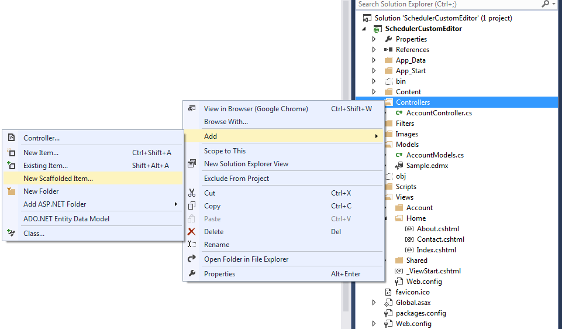
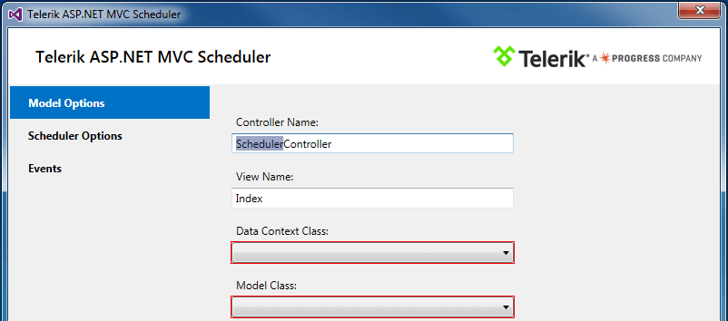
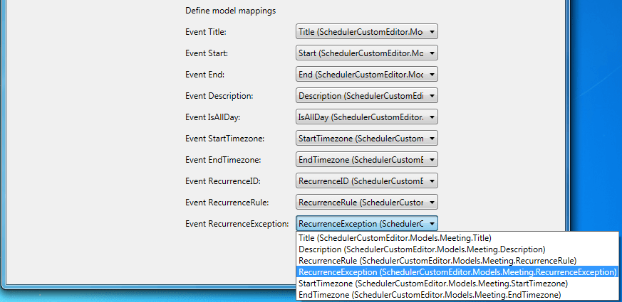
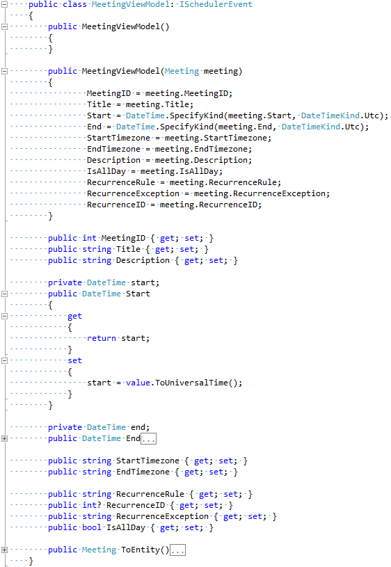
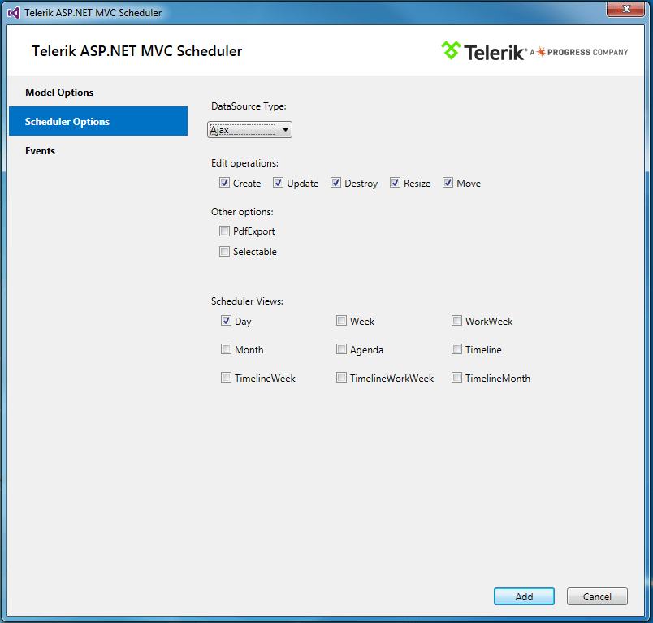
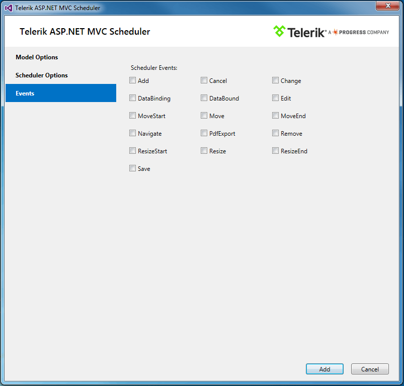

# Scaffolding

The Scheduler HtmlHelper for ASP.NET MVC enables you to use the Kendo UI Scaffolder Visual Studio extension.

> The Kendo UI Scaffolder will not include the required UI for ASP.NET MVC files to the project. To automatically achieve this, use the [Telerik UI for ASP.NET MVC Visual Studio Extensions](). To manually achieve this, refer to [this article]().

To scaffold the Scheduler HtmlHelper for ASP.NET MVC:

1. Create a new ASP.NET MVC application, include an Entity Framework Data Model, and add Telerik UI for ASP.NET MVC.
1. Right-click the location where the `Scheduler Controller` should be generated. Select **Add** > **New Scaffolded Item...** from the displayed menu. In this example, you are going to generate it in the **Controllers** folder.

    

1. Select **Kendo UI Scaffolder** from the list of available scaffolders. Then choose the desired Scheduler option.

    

1. On the next screen that displays the `Model` and `Data Context` options, enter the `Controller` and `View` names.

    

1. The **Model Class** drop-down list contains all model types from the active project. List the products in the Scheduler. In this case, select the **Meeting** entity.

    

1. From the **Data Context Class** DropDownList, select the **Entity Framework Data Model** class to be used. In this case, select **SampleEntities**. Note that the DataBase used is taken from the [offline examples](#sample-application).

    

1. Select the fields from your original model that match the fields from the required `ISchedulerEvent` interface. The Scaffolder automatically generates a view model that inherits from the `ISchedulerEvent` interface. This view model includes a constructor and a method that map the view model fields to the original model:

    

    The newly created class will later be added to the `~/Models` folder.

    

1. Click **Scheduler Options**.

    

    This screen contains the Scheduler functionalities that can be configured before scaffolding:

    * **DataSource Type**&mdash;Ajax or WebApi.
    * **Edit operations**&mdash;Configures the operations to be included (**Create**, **Update**, **Destroy**, **Resize**, **Move**).
    * **Other options** > **PDF Export**&mdash;Enables the PDF export functionality.
    * **Other options** > **Selectable**&mdash;Enables the selection functionality.
    * **Scheduler Views**&mdash;Opts for the desired views.

1. Click **Events**. Select the Scheduler events that you want to attach handlers to.

    

1. When finished with the Scheduler configuration, click **Add**. The `Scheduler Controller` and the corresponding `View` are now generated.

## See Also

* [Basic Usage of the Scheduler HtmlHelper for ASP.NET MVC (Demo)](https://demos.telerik.com/aspnet-mvc/scheduler)
* [SchedulerBuilder Server-Side API](https://docs.telerik.com/aspnet-mvc/api/kendo.mvc.ui.fluent/schedulerbuilder)
* [Scheduler Server-Side API](/api/scheduler)
