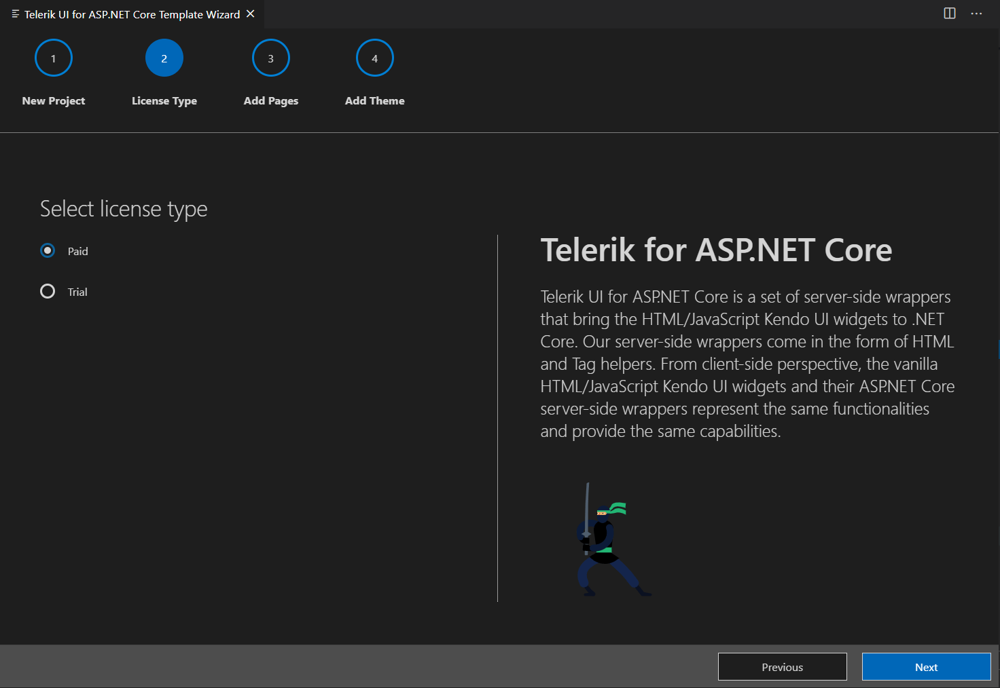
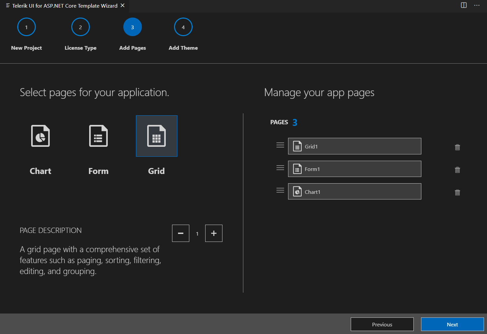

# Visual Studio Code Integration Overview

The **Telerik UI for ASP.NET Core Template Wizard** [Visual Studio Code](https://code.visualstudio.com/) Extension enhances the experience in developing ASP.NET Core web applications with Telerik UI for ASP.NET Core.

As its primary advantage, the VS Code extension facilitate the creation of projects through a wizard directly in Visual Studio Code.

## Get the Extension

You can get the extention:

* from the [Visual Studio Marketplace](https://marketplace.visualstudio.com/items?itemName=TelerikInc.aspnetcoretemplatewizard)

* by opening the **Extensions** tab in Visual Studio Code, then searching for **Telerik UI for ASP.NET Core Template Wizard** and clicking **Install**

## Create a Telerik Project

To create a Telerik-enabled ASP.NET Core project:

1. Press `Ctrl`+`Shift`+`P` in Windows/Linux or `Cmd`+`Shift`+`P` on Mac to open VSCode's extension launcher

    

1. Type/Select `Telerik UI for ASP.NET Core Template Wizard: Launch` and press `Enter` to launch the extension

1. The wizard will now guide you through the project creation steps:
    1. Choose a project name and location
    
        
        
    1. The type of your Telerik license (trial or commercial, depending on what you have)
    
        
    
    1. Add some sample pages to get you started (a grid with CRUD operations, a form and charts)
    
        
    
    1. Choose a Theme.
    
        

1. When you open the project, to run it:

    1. Open the terminal and navigate to the project folder.

    1. Execute `dotnet run` and navigate your browser to the link you see in the console output.

    Alternatively, you may open the solution file with Visual Studio and build the application. Once the NuGet packages get restored and the build passes, you will have your ASP.NET Core project up and running.

1. You now have a ASP.NET Core app running!

## Troubleshooting

If the extension does not work right (missing pages, does not start, etc.), you can try the following to clean up cache files and get it working again:

1. Uninstall the extension from VS Code.
2. Go to the extensions templates cache folder and delete the `CoreT` folder - this is where cache for the Telerik extensions are kept:
    * on Windows, open `%localappdata%` 
    * on Mac, open `/Users/[user_name]/.local/share/`
3. [Install](https://marketplace.visualstudio.com/items?itemName=aspnetcoretemplatewizard) the extension again.

If you see `Response status code does not indicate success: 401 (Logon failed.).`, then the Nuget.Config file in `%APPDATA%\NuGet` may contain invalid credentials or keys. For more information check the [Nuget Install article](#setup-with-nuget-cli) or [Nuget Setup with CLI article](#integrating-ui-for-aspnet-core)