# Build the Team Efficiency Dashboard Project

## Getting Up and Running

In this chapter you are going to start with the basics, including starting a new project, adding Telerik UI for MVC to your project, and installing the quick start boilerplate.

### Create a New MVC Project

#### Overview

Telerik UI for ASP.NET MVC can easily be added to an existing ASP.NET MVC project using VisualStudio in just a few clicks. Start by creating a new ASP.NET MVC project. You will use this project throughout the rest of this tutorial to build your application.

#### Exercise: Create a New MVC Project

1. Click **File** > **New Project**.

1. In the **New Project** dialog, choose the **ASP.NET Web Application** template by expanding the **Templates** tree to **Templates** > **Visual C#** > **Web**.

    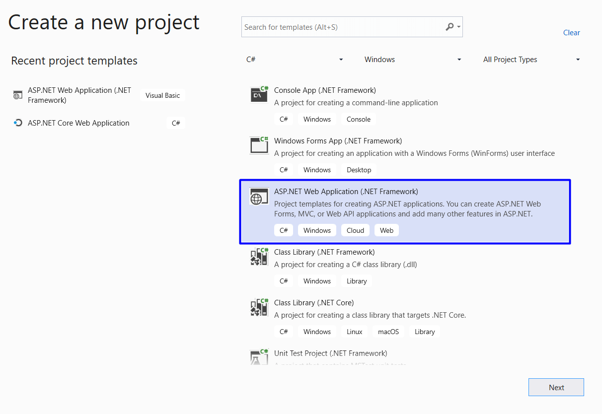

1. Give the application a name, for example, **MyQuickStartApp**. Click **OK** to continue.

1. In the **New ASP.NET Project** dialog, choose **MVC** from the template selection.

    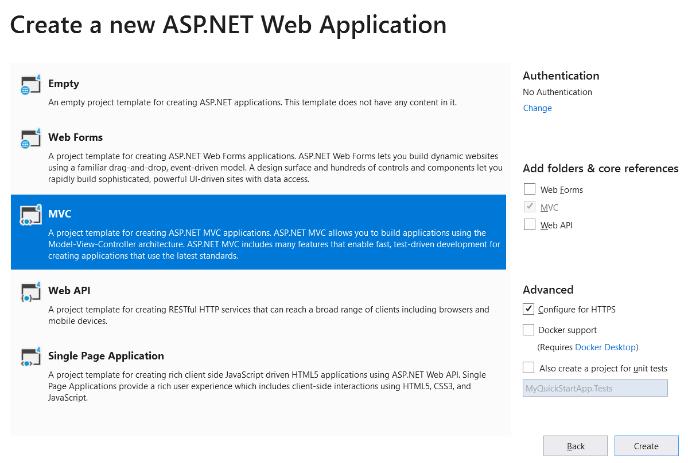

1. Click **OK** to finish.

### Install the Quick Start Boilerplate

#### Overview

With the new project created, it is time to start building your app. For this guide, we have scaffolded out a boilerplate project to act as a starting point for the Team Efficiency Dashboard application.

The boilerplate has an HTML page, a layout, the Northwind database, and some server-side code you may find in a typical MVC project.

#### Exercise: Install the Quick Start Boilerplate

1. Using the package manager console, run the command below.

        PM> Install-Package KendoQsBoilerplate

    Alternatively, you can use the GUI package manager.

1. From the Solution Explorer, right-click **References**, then choose **Manage NuGet Packages**.

    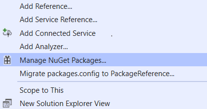

1. Search for **KendoQsBoilerplate**.

    

1. Click **Install** to continue.
1. When the package installs, you may be prompted to accept a license agreement for the NorthwindDB. Click **I Accept** to continue.
1. It is normal for the quick start boilerplate to overwrite existing files. When prompted with a file conflict, choose **Yes to All**.

    

1. With the boilerplate installed, take a moment to run the application. If all went well, you should see something similar to what is shown below.

    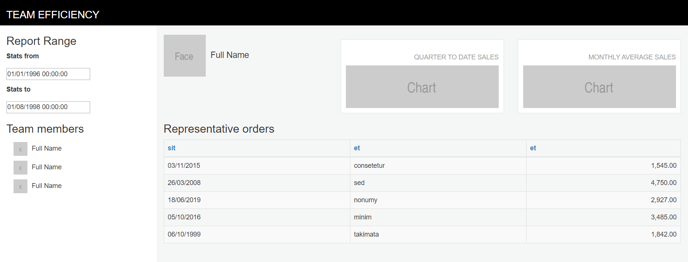

### Convert to Telerik Applications

#### Overview

At this point, you have the wire frame for a basic MVC application. Next, you will be adding the UI for ASP.NET MVC to the application by using the **Convert to Telerik Application** tooling. When an application is converted to a Telerik application, all required HTML, CSS, JavaScript and `.DLL` libraries are added. This is the first step you would take to upgrade a new or existing MVC project to use Telerik UI for ASP.NET MVC.

#### Exercise: Convert to a Telerik Application

1. Stop the application if it is already running.
1. In the Solution Explorer, right-click the project name and select **Telerik UI for ASP.NET MVC** > **Convert to Telerik Application**. This will launch the **Project Configuration** wizard. From here you can choose settings for your Telerik project.

    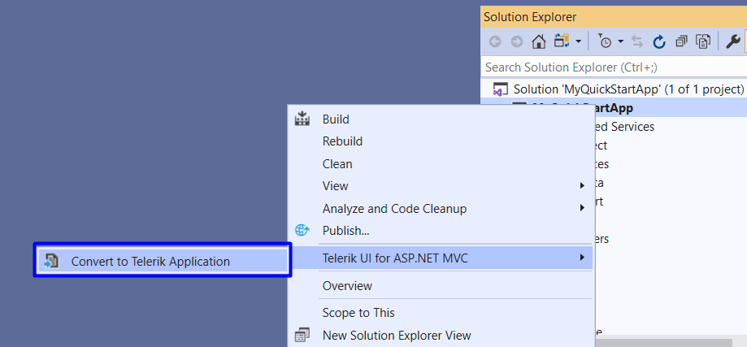

1. For this tutorial your project will use CDN support. This means that all Kendo UI resources are served from Telerik content delivery network (CDN) versus relying on your server for the assets. Verify that the box **Use CDN support** is checked and click **Finish** to continue.

    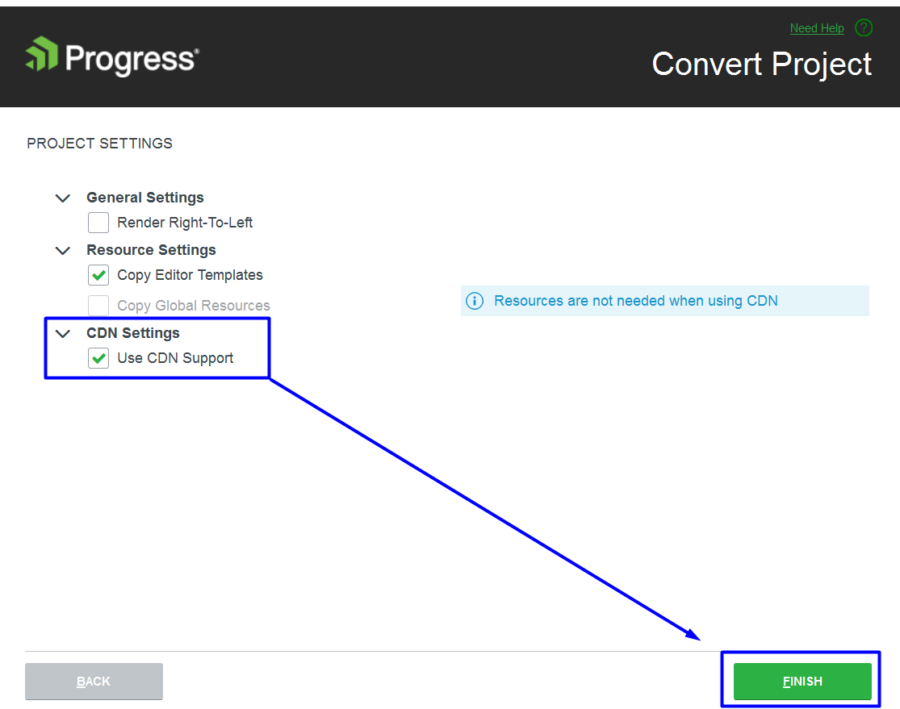

1. Since the boilerplate is designed with [Bootstrap](https://getbootstrap.com), choose **Bootstrap** from themes select box so the theme matches the current look of the boilerplate. You'll change the theme later when you're ready to customize the look of the application.

    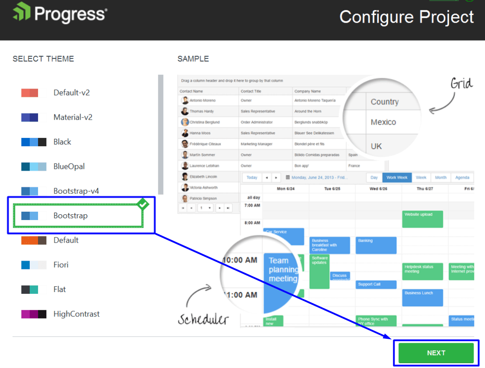

1. Open `\Views\Shared\_Layout.cshtml`. Find and remove the `@Scripts.Render("~/bundles/modernizr")` script bundle. This script is included with the Kendo UI assets.
1. Next, find the CSS `@Styles.Render("~/Content/css")` bundle and move it just above the closing head tag `</head>`. This will ensure that the custom styles are applied when you customize the application.
1. The final code of the head section should look like the one shown in the example below.
        
        <meta charset="utf-8" />
        <meta name="viewport" content="width=device-width, initial-scale=1.0">
        <title>@ViewBag.Title - UI for MVC / Kendo Quick Start Guide</title>
        <link href="https://kendo.cdn.telerik.com/{{ site.mvcCoreVersion }}/styles/kendo.common-bootstrap.min.css" rel="stylesheet"   type="text/css" />
        <link href="https://kendo.cdn.telerik.com/{{ site.mvcCoreVersion }}/styles/kendo.bootstrap.min.css" rel="stylesheet"  type="text/css" />
        <link href="@Url.Content("~/Content/bootstrap.min.css")" rel="stylesheet" type="text/css" />
        <link href="@Url.Content("~/Content/Site.css")" rel="stylesheet" type="text/css" />
        <script src="https://kendo.cdn.telerik.com/{{ site.mvcCoreVersion }}/js/jquery.min.js"></script>
        <script src="https://kendo.cdn.telerik.com/{{ site.mvcCoreVersion }}/js/jszip.min.js"></script>
        <script src="https://kendo.cdn.telerik.com/{{ site.mvcCoreVersion }}/js/kendo.all.min.js"></script>
        <script src="https://kendo.cdn.telerik.com/{{ site.mvcCoreVersion }}/js/kendo.aspnetmvc.min.js"></script>
        <script src="@Url.Content("~/Scripts/bootstrap.min.js")"></script>
        <script src="@Url.Content("~/Scripts/kendo.modernizr.custom.js")"></script>
        @Styles.Render("~/Content/css")

> Because the **Convert to Telerik application**, **Upgrade Project**, or **Configure Project** wizards modify the `_Layout.cshtml` file, make sure you check the position of the custom CSS declarations afterwards.

Now that your app is ready for development. Let's add some simple input components to create a nice user experience.

## Input Controls

In this chapter you'll learn how to add Kendo UI widgets to your application. UI for MVC has powerful HTML Helpers that configure and render Kendo UI widgets.

### Kendo UI Helper Overview

#### Server-Side Wrappers

Telerik UI for ASP.NET MVC is a set of server-side wrappers. A server-wrapper does the following:

- Allows the developer to configure a Kendo UI widget via C# or VB.NET code&mdash;set its value, data source, etc.
- Renders the HTML and JavaScript needed to initialize the Kendo UI widget. The widget options propagate to the client side via the widget initialization script.


#### Configuration

The Kendo UI HtmlHelper exposes all Kendo UI server wrappers.


#### Widget Options

The widget options are exposed via a fluent interface.


Below is an example of how a NumericTextBox input is created.

    @(Html.Kendo().NumericTextBox()
        .Name("age") // set the name of the NumericTextBox
        .Value(10) //set the value
        .Spinners(false) // disable the spinners
    )

### Adding a Kendo UI DatePicker

#### Overview

Let's open the `Index.cshtml` page under the folder `~\Views\Home\`. The `Index.cshtml` page is where most of the application's UI lives. This page currently contains basic HTML inputs to collect date input from the user. To provide a better user experience, replace the standard HTML inputs with Kendo UI date picker controls. The Kendo UI date picker controls offer users a flyout calendar to choose a desired date.

> The Kendo UI DatePicker control is touch and mouse friendly. No additional code is necessary to support tablets and phones.

#### Exercise: Replace StatsFrom and StatsTo TextBoxes with Kendo UI Date Pickers

1. Open `~\Views\Home\Index.cshtml` and find the `StatsFrom` text box helper.

        <!-- Stats From Date Picker -->
    	@Html.TextBox("StatsFrom", new DateTime(1996, 1, 1))

1. Replace the text box helper with a Kendo UI date picker. Set the `Name` property to `StatsFrom` and the `Value` with a new `DateTime` of `1996,1,1`.

    	<!-- Stats From Date Picker -->
    	@(Html.Kendo().DatePicker()
               .Name("StatsFrom")
               .Value(new DateTime(1996, 1, 1))
        )

1. Find the `StatsTo` text box helper.

    	<!-- Stats To Date Picker -->
    	@Html.TextBox("StatsTo", new DateTime(1996, 1, 1))

1. Replace the text box helper with a Kendo UI DatePicker. Set the `Name` property to `StatsTo` and the `Value` with a new `DateTime` of `1998,8,1`.

    	<!-- Stats To Date Picker -->
    	@(Html.Kendo().DatePicker()
        		.Name("StatsTo")
    			.Value(new DateTime(1998, 8, 1))
    	)

The Kendo UI HTML helper's fluent interface lets you configure a widget's behavior and appearance. The code you just added uses the following properties:

- `Name`&mdash;The property sets the rendered HTML element's id property.
- `Value`&mdash;Sets a default selected date value for the date picker.

After you run your app with this change, you will see a calendar icon in the **Stats from** field. Click or tap the icon to reveal the date picker.

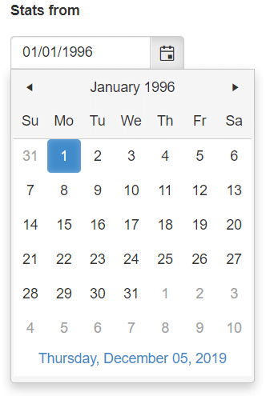

With the inputs upgraded, let's move on to the extremely robust Kendo UI Grid.

## Scaffolding

In this chapter, you'll learn how to add leverage Telerik UI for ASP.NET MVC scaffolding capabilities. One feature that MVC developers are quite used to is scaffolding. Visual-Studio-powered MVC scaffolding is a code generation framework that allows you to hook up your model to a controller and render views that are strongly typed, among other things. Since the scaffolding is simply a code generation tool, you are free to change any of the code that it generated.

### Upgrade the Database

#### Overview

A copy of the Northwind database is included in the Kendo UI Quick Start Boilerplate. Before you begin scaffolding, make sure the Northwind database is upgraded. Having a working connection to the database is needed for the scaffolding wizard to work properly.

> Upgrading the database is only necessary for this guide because the database supplied must support multiple versions of SQL. Therefore, we chose the lowest database version possible.

#### Exercise: Upgrade the Northwind Database

> If you do not have an SQL Server instance installed on your machine, you may need to install the SQL Server Express Edition from Microsoft. You can download the free installer [here](http://www.microsoft.com/en-us/server-cloud/products/sql-server-editions/sql-server-express.aspx).

1. Using Visual Studio's **Server Explorer**, expand **DataConnections**, and right-click **NorthwindDB** > **Modify Connection**.

    

1. Next, click **OK**.

    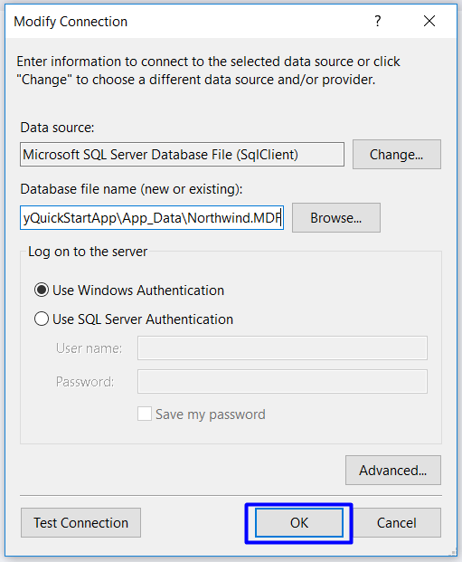

1. Finally, click **Yes** to complete the upgrade.

    

1. Once the upgrade is complete, expand the Northwind Database Tables to verify connectivity.

    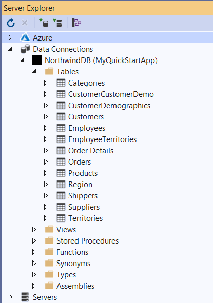

With the database upgraded, use the scaffolding wizard to create an interactive grid view.

### Telerik UI for MVC Scaffolding Wizard

#### Overview

The scaffolding wizard will aid you in creating the view by providing point-and-click configuration screen. Use the scaffolding wizard to create an interactive Kendo UI Grid view of invoices for the Team Efficiency Dashboard. By enabling grid features such as sorting, paging, and exporting, users will be able to analyze and share data in a familiar way.

#### Exercise: Scaffold a Grid View of Invoices

1. Start the scaffolding wizard by right-clicking **Controllers** > **Add** > **New Scaffolded Item**. The Scaffolder should be automatically installed. In case it is not, navigate to `\wrappers\aspnetmvc\Scaffolding` and click on **KendoScaffolderExtension.vsix** to install the Scaffolder manually.

    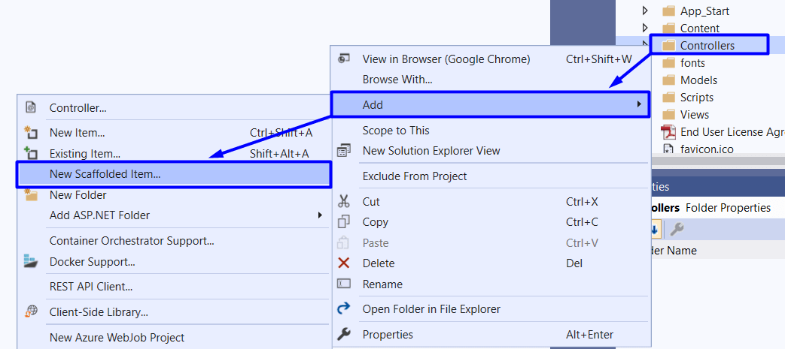

1. Choose **Kendo UI Scaffolder** and click **Add** to continue.

    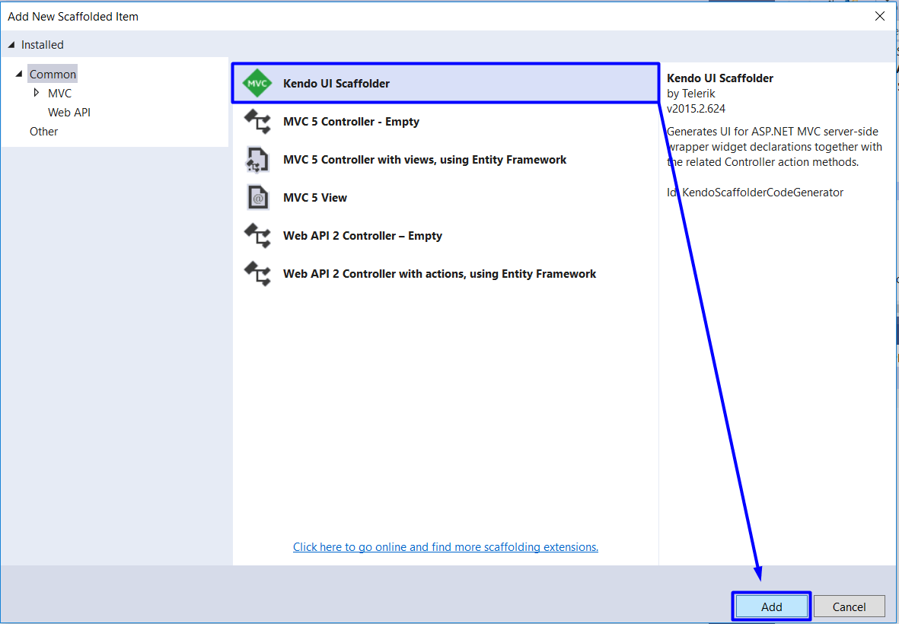

1. Notice that the Scaffolder is capable of creating Grid, Chart, and Scheduler views for both C# and JavaScript. For this guide you'll be using the Telerik UI for MVC Grid scaffolding option. Choose **Telerik UI for MVC Grid** and click **Add** to continue.

    

1. From the **Telerik UI for MVC Grid** scaffolding dialog, the Grid's model options, Grid options and events are defined. The Model Options control the following settings:

    - **Controller Name**&mdash;The name of the controller created by the Scaffolder.
    - **View Name**&mdash;The name of the created view, which will display the scaffolded grid.
    - **Model Class**&mdash;The model the Scaffolder which will be used to build the view.
    - **Data Context Class**&mdash;The Entity Framework DbContext used to connect the view to the data.

1. Define the Grid's model options using the following values:

    - **Controller Name**: **InvoiceController**
    - **View Name**: **Index**
    - **Model Class**: **Invoice**
    - **Data Context Class**: **NorthwindDBContext**

    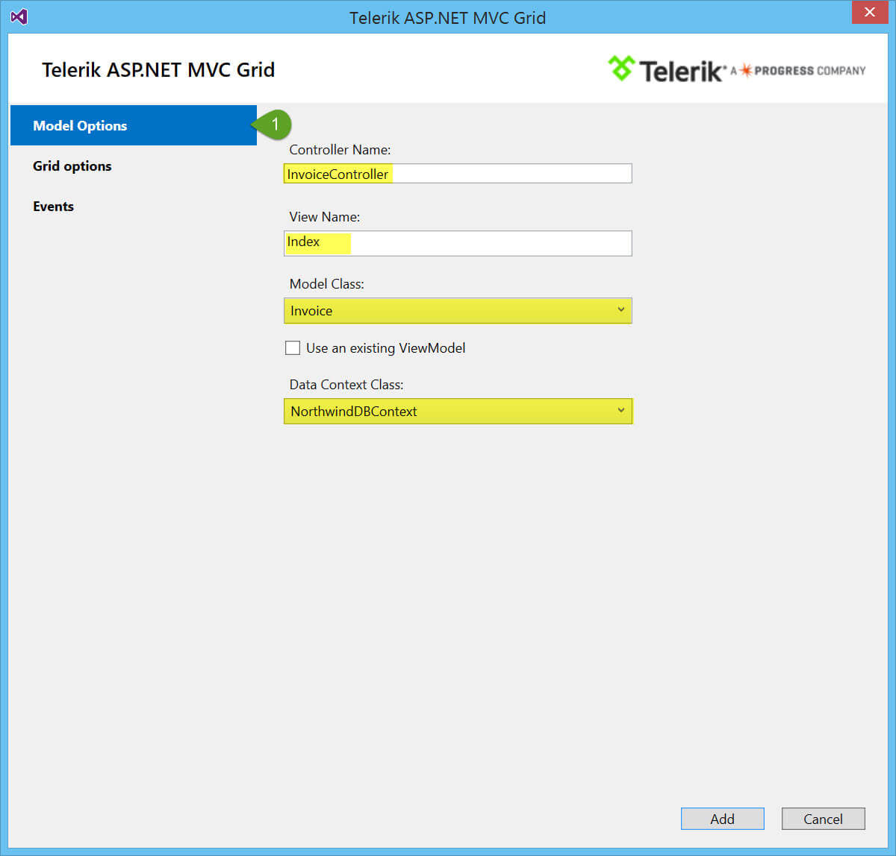

    The Grid options control which features are scaffolded and enabled on the Grid, including:

    - `DataSource` Type&mdash;`Ajax`, `Server`, or `WebApi`.
    - `Editable`&mdash;Enable the editing, configure the edit mode (`InLine`, `InCell` or `PopUp`) and the operations to be included (`Create`, `Update`, `Destroy`).
    - `Filterable`&mdash;Enable the filtering of the Grid and select the filter mode.
    - `Column Menu`&mdash;Enable the column menu.
    - `Navigatable`&mdash;Enable the keyboard navigation.
    - `Pageable`&mdash;Enable the paging of the Grid.
    - `Reorderable`&mdash;Enable the column reordering.
    - `Scrollable`&mdash;Enable the scrolling of the Grid table.
    - `Selectable`&mdash;Enable the selection and specify the selection mode and type.
    - `Sortable`&mdash;Enable the sorting and specify the sorting mode.
    - `Excel Export`&mdash;Enable the Excel export functionality.
    - `PDF Export`&mdash;Enable the PDF export functionality.

1. Define the Grid's options by setting the following values:

    - `unchecked` Scrollable
    - `checked` Sortable
    - `checked` Pageable
    - `checked` Excel Export
    - `checked` PDF Export

    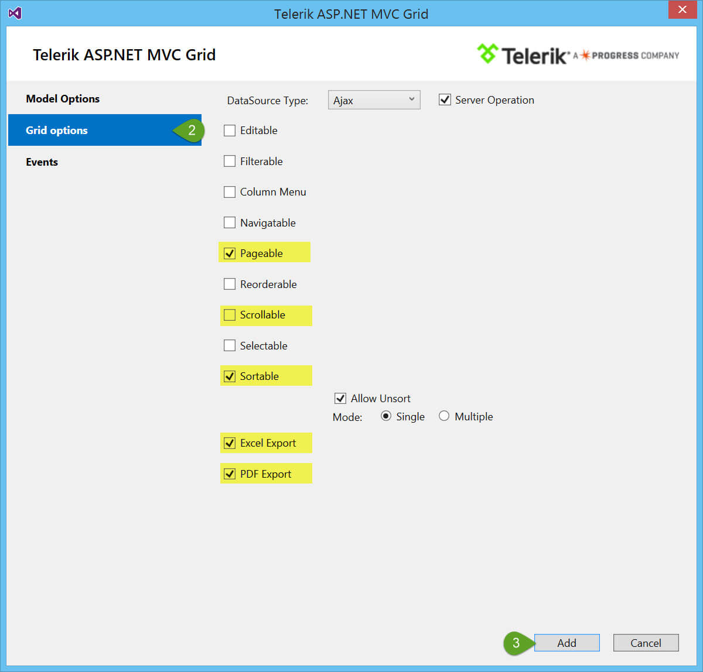

1. Click **Add** to continue and create the scaffolded items.

    The Scaffolder will create the following files:

    - `Controllers/InvoiceController.cs`&mdash;This controller has the actions for the features selected in the scaffolding wizard.
        - `Index`&mdash;Returns the view.
        - `Invoices_Read`&mdash;Gets all invoices from the database and returns a JSON formatted `DataSourceRequest` object. The `DataSourceRequest` will contain the current grid request information (page, sort, group, and filter).
        - `Excel_Export_Save`&mdash;Creates an XLS exported File result.
        - `Pdf_Export_Save`&mdash;Creates a PDF exported File result.
    - `Views/Invoice/Index.cshtml`&mdash;This view contains the markup and HTML helper responsible for rendering the Grid control.

1. Run the application and navigate to `/Invoice/index` to see the generated Grid control. You should see the following output.

    

Now that the Telerik UI for MVC Scaffolder has generated a starting point for working with the Grid, you can modify the scaffolded code to meet your needs. In the next chapter we'll do just that.

## Kendo UI Grid

In this chapter you will modify the scaffolded Grid code to further customize the Grid's appearance. Additionally, you'll be incorporating the Grid into the Team Efficiency Dashboard's main view.

### Configuring Kendo UI Grid Options

#### Overview

As you may have noticed in the scaffolding wizard, the Grid is a versatile component with many options. The options for the Grid are set using the server-side HTML wrapper. Take a close look at the code generated by the Scaffolder in `/Views/Invoices/Index.cshtml`. Below is a breakdown with additional comments of what each configuration method is used for. Also, note that the fluent API chain can be extended to include further options and there is no strict order in which the options are defined.

        @(Html.Kendo().Grid<KendoQsBoilerplate.Invoice>() // Kendo UI Grid Wrapper
            // Name, also HTML elements "id" attribute
            .Name("grid")
            // Grid column bindings
            .Columns(columns =>
            {
                columns.Bound(c => c.CustomerName);
                columns.Bound(c => c.OrderDate);
                columns.Bound(c => c.ProductName);
                columns.Bound(c => c.UnitPrice);
                columns.Bound(c => c.Quantity);
                columns.Bound(c => c.Salesperson);
            })
            // Toolbars
            .ToolBar(toolbar => {
                    toolbar.Excel();
                    toolbar.Pdf();
            })
            // Enable Paging
            .Pageable()
            // Enable Sorting
            .Sortable(sortable => {
                sortable.SortMode(GridSortMode.SingleColumn);
            })
            // Disable Scrolling
            .Scrollable(scrollable => scrollable.Enabled(false))
            // Datasource configuration
            .DataSource(dataSource => dataSource
                .Ajax()
                // Read method action and controller
                .Read(read => read.Action("Invoices_Read", "Invoice"))
            )
        )

> If you find the comments above useful, feel free to copy them into your project. Comments are completely valid inside the Fluent API chain.

#### Exercise: Modify the Grid's Name Property

1. Change the Grid's `Name` from `"grid"` to `"EmployeeSales"`. This is an important step since the `Name` property of all Telerik UI for MVC wrappers set the `id` attribute of the rendered Kendo UI widget.
1. Find the `.Name` method and change the value from `"grid"` to `"EmployeeSales"`.

    	@(Html.Kendo().Grid<KendoQsBoilerplate.Invoice>()
    	      .Name("grid")
    		  ...
    	)

The resulting code should look like the one in the example below.

       @(Html.Kendo().Grid<KendoQsBoilerplate.Invoice>()
    	      .Name("EmployeeSales")
    		  ...
    	)

1. Now add the EmployeeSales grid to the Dashboard page `/Home/Index.cshtml`. To keep things tidy, add the grid to the Dashboard as a child action using `Html.Action` in the `/Home/Index.cshtml` view. This will keep the Grid's view and controller code separate and easy to find.

#### Exercise: Add the Grid to the Dashboard

1. Ensure the application's layout is not repeated. Set the `Layout` of the view to `null`. Skipping this step will result in duplicate scripts which could cause the page to load improperly.
1. At the top of `/Views/Invoices/Index.cshtml`, add `@{ Layout = null;}`.

    The resulting code should be like the one in the example below.

    	@{ Layout = null;}
        @(Html.Kendo().Grid<KendoQsBoilerplate.Invoice>()
    	      .Name("EmployeeSales")
    		  ...
    	)

1. Add the grid as a child action. Open `/Home/Index.cshtml`, locate the `<!-- Invoices -->` placeholder, and replace it with the `@Html.Action("Index","Invoice")` child action.

    	<!-- Invoices -->
        @Html.Ipsum().table(5, 3, "d,t,n", new { @class = "table table-striped table-bordered" })

    The resulting code should be like the one in the example below.

        <!-- Invoices -->
    	@Html.Action("Index","Invoice")

1. Run the project and visit the dashboard page `/Home/Index` in the browser. Take a moment to interact with the grid's sorting, paging, and exporting features.
1. Currently, the data in the **Order Date** Grid column is verbose and looks like `Mon Aug 25 1997 00:00:00 GMT-0400 (Eastern Daylight Time)`. This isn't very user-friendly, let's change that. The Grid's data can easily be formatted by adding the `.Format` property chain to any column. Use the `MM/dd/yyyy` Date Format on the `OrderDate` column using the `.Format` method.

#### Exercise: Customize the Order Date Column Formatting

You can keep the application running while performing this exercise.

1. Open `/Views/Invoice/Index.cshtml` and find the `OrderDate` column property.

        columns.Bound(c => c.OrderDate);

1. Set the `OrderDate` column's `Format` property to `"{0:MM/dd/yyyy}"` to apply the format to the column.

    The resulting code should be like the one in the example below.

    	columns.Bound(c => c.OrderDate).Format("{0:MM/dd/yyyy}");

1. Refresh the application to see the formatting changes taking place. Notice that the `OrderDate` column is now much easier on the eye.

While interacting with the Grid, you may have noticed that all of the records are being pulled from the database. Don't worry, as we progress through the next several chapters this will change as you learn how to work with Kendo UI and datasources on the client side. First, let's set up some additional UI elements to provide a source for filtering data.

## Kendo UI ListView

In this chapter you will learn about the Kendo UI ListView control and client-side templates. Using the ListView you'll create a list of employees containing the employee's full name and avatar image. This ListView will allow users to interact with the dashboard by filtering the data.

### The ListView Control

#### Overview

The purpose of [Kendo UI ListView](https://docs.telerik.com/kendo-ui/controls/data-management/listview/overview) is to display a custom layout of data-bound items through templates. The ListView is ideally suited for scenarios where you wish to display a list of items in a consistent manner.

The ListView is designed to put you back in control when it comes to displaying data. It does not provide a default rendering of data-bound items, but, instead, relies entirely on templates to define how a list of items&mdash;including alternating items and items being edited&mdash;is displayed.

    @(Html.Kendo().ListView<KendoQsBoilerplate.Employee>()//The listview data source will infer the Employee Model properties and their types
        .Name("EmployeesList") // Name is mandatory. It specifies the "id" attribute of the widget.
        .TagName("ul") // TagName is mandatory. It specifies the element which wraps all listview items.
        .ClientTemplateId("EmployeeItemTemplate") // The template is mandatory and will be used for rendering the listview items.
        .DataSource(dataSource => {
            dataSource.Read(read => read.Action("EmployeesList_Read", "Home"));
        }) 
        .Selectable(s => s.Mode(ListViewSelectionMode.Single))
    )

Use a ListView to create a selectable list of employees containing the employee's full name and avatar image.

#### Exercise: Add a ListView to the Dashboard

1. Open `/Views/Home/Index.cshtml` and find the `<!-- Employee List View -->` placeholder.
1. Remove the `<ul>` and its child elements that follow `<!-- Employee List View -->`.
1. Now add a Kendo UI ListView of type `KendoQsBoilerplate.Employee` using the `@(Html.Kendo().ListView<KendoQsBoilerplate.Employee>()` Fluent HTML Helper.
1. Set the `Name` property to `"EmployeesList"`.

        .Name("EmployeesList")

1. Set the `ClientTemplateId` property to `"EmployeeItemTemplate"`. The template `EmployeeItemTemplate` will be created later in the exercise.

        .ClientTemplateId("EmployeeItemTemplate")

1. Set the `TagName` property to `"ul"`. The `TagName` is the element type that will wrap the ListView items when the control is rendered. In this case, we're creating an unordered list element.

        .TagName("ul")

1. Set the `DataSource` read action to `"EmployeeList_Read"` and the controller to `"Home"`. The action will be created later in the exercise.

        .DataSource(dataSource =>
        {
            dataSource.Read(read => read.Action("EmployeesList_Read", "Home"));
        })

1. Set the select mode by setting the `Selectable` property to `ListViewSelectionMode.Single`.

        .Selectable(s => s.Mode(ListViewSelectionMode.Single))

    The resulting code should look like the one in the example below.

    	<!-- Employee List View -->
    	@(Html.Kendo().ListView<KendoQsBoilerplate.Employee>()
            .Name("EmployeesList")
            .ClientTemplateId("EmployeeItemTemplate")
            .TagName("ul")
            .DataSource(dataSource =>
            {
                dataSource.Read(read => read.Action("EmployeesList_Read", "Home"));
            })
            .Selectable(s => s.Mode(ListViewSelectionMode.Single))
        )

Now that the ListView is defined, you'll need to supply the datasource with the employee data by creating the `read` action for the ListView.

#### Exercise: Create the EmployeesList_Read Action

1. Since you will need to update the `HomeController`, stop the project if it is already running.

1. Open `Controllers/HomeController.cs` and add a reference to `Kendo.Mvc.UI` and `Kendo.Mvc.Extensions`. These dependencies are needed for the `DataSourceRequest` object and `.ToDataSourceResult` extension method.

    At the top of the file you should have the statements as shown in the example below.

    	using Kendo.Mvc.UI;
    	using Kendo.Mvc.Extensions;

1. Now, create an `ActionResult` named `EmployeesList_Read` that accepts a `DataSourceRequest` parameter. The parameter of type `DataSourceRequest` will contain the current ListView request information. Decorate that parameter with the `DataSourceRequestAttribute` which is  responsible for populating the `DataSourceRequest` object.

        public ActionResult EmployeesList_Read([DataSourceRequest]DataSourceRequest request)
        {
        }

1. Use entity framework to query a list of employees, ordered by `FirstName` from the database and return the result as `Json` using the `.ToDataSourceResult` extension method. The method will format the data to be consumed by the ListView.

        public ActionResult EmployeesList_Read([DataSourceRequest]DataSourceRequest request)
        {
            var employees = db.Employees.OrderBy(e => e.FirstName);
            return Json(employees.ToDataSourceResult(request, ModelState), JsonRequestBehavior.AllowGet);
        }

The ListView is almost complete. However, the ListView still needs a template to apply to the data when it is rendered to the page. In the previous exercise the `ClientTemplateId` was defined, but was not created. Let's learn about Kendo UI Templating and complete the ListView.

### Kendo UI Templates

### Overview

The [Kendo UI Templates](https://docs.telerik.com/kendo-ui/framework/templates/overview) provide a simple-to-use, high-performance JavaScript templating engine within the Kendo UI framework. Templates offer a way to create HTML chunks that can be automatically merged with JavaScript data. They are a substitute for traditional HTML string building in JavaScript.

Kendo UI Templates use a simple templating syntax called hash templates. With this syntax, the `#` (hash) sign is used to mark areas in a template that should be replaced by data when the template is executed. The `#` character is also used to signify the beginning and end of custom JavaScript code inside the template.

There are three ways to use the hash syntax:

- Render values as HTML: `#= #`.
- Use HTML encoding to display values: `#: #`.
- Execute arbitrary JavaScript code: `# if (true) { # ... non-script content here ... # } #`.

    <script type="text/x-kendo-template" id="myTemplate">
        #if(isAdmin){#
            <li>#: name # is Admin</li>
        #}else{#
            <li>#: name # is User</li>
        #}#
    </script>

#### Exercise: Create the ListView Template for Showing Employees

1. Open `/Views/Home/Index.cshtml` and find the `<!-- Kendo Templates -->` placeholder.
1. After `<!-- Kendo Templates -->`, add a new `<script>` element of `type` `"text/x-kendo-tmpl"` with an `id` of `EmployeeItemTemplate`

    The resulting code should be like the one shown below.

    	<!-- Kendo Templates -->
    	<script type="text/x-kendo-tmpl" id="EmployeeItemTemplate">
    	</script>
    	<!-- /Kendo Templates -->

1. Inside the template, create a `<li>` and set the class to `employee`.
1. Add a `<div>` element inside the `<li>`. Inside the `<div>`, add an image that corresponds to the `EmployeeId` by setting the `src` to `"@(Url.Content("~/content/employees/"))#:EmployeeId#-t.png"` and a `<span>` with the template field `#: FullName #`.

    The resulting code should be like the one shown below.

    	<!-- Kendo Templates -->
    	<script type="text/x-kendo-tmpl" id="EmployeeItemTemplate">
    	    <li class="employee">
    	        <div>
    	            
    	            <span> #: FullName #</span>
    	        </div>
    	    </li>
    	</script>
    	<!-- /Kendo Templates -->

1. Run the application to see the ListView in action.

If everything was done correctly, the ListView should look like the one shown below.


At this point you can select items from the list, but before the dashboard can become truly interactive you'll need to work with the client-side APIs.

## Client Side

The client side is where Kendo UI really shines. Kendo UI uses a common JavaScript language and standards so that it’s easy for any JavaScript developer to get started. In this chapter you'll learn about client-side events and how to take control of Kendo UI using JavaScript.

### Working with Client-Side Events

#### Overview

Telerik UI for MVC helpers provide an Events method that is part of the HTML Helper's property chain. The `events` method is used to set event handlers for the Kendo UI widget. Each widget has a variety of events that can be handled including: `cancel`, `change`, `dataBound`, `dataBinding`, `edit`, `remove`, and `save`.

     @(Html.Kendo().ListView<KendoQsBoilerplate.Employee>()
        .Name("EmployeesList")
        .TagName("ul")
        .ClientTemplateId("EmployeeItemTemplate")
        .DataSource(dataSource => {
            dataSource.Read(read => read.Action("EmployeesList_Read", "Home"));
        })
        .Selectable(s => s.Mode(ListViewSelectionMode.Single))
        .Events(e => e
            .DataBound("onListDataBound")
            .Change("onCriteriaChange")
        )
    )

Let's continue to work with the `EmployeesList` that was created in the previous chapter. The list is selectable, but when the application starts the first item should be selected by default giving the user a starting point to begin interacting with the dashboard.

#### Exercise: Select the First List Item by Default

1. Find the `EmployeeList`.

    	<!-- Employee List View -->
    	@(Html.Kendo().ListView<KendoQsBoilerplate.Employee>()
            .Name("EmployeesList")
    		...
            .Selectable(s => s.Mode(ListViewSelectionMode.Single))
    	)

1. Add an event handler named `onListDataBound` for the `DataBound` event for the EmployeeList.

    	@(Html.Kendo().ListView<KendoQsBoilerplate.Employee>()
    		...
    		.Selectable(s => s.Mode(ListViewSelectionMode.Single))
    		.Events(e => e.DataBound("onListDataBound"))
    	)

    The resulting code should be like the one shown below.

    	<!-- Employee List View -->
    	@(Html.Kendo().ListView<KendoQsBoilerplate.Employee>()
        	.Name("EmployeesList")
            .ClientTemplateId("EmployeeItemTemplate")
            .TagName("ul")
            .DataSource(dataSource =>
            {
            	dataSource.Read(read => read.Action("EmployeesList_Read", "Home"));
            	dataSource.PageSize(9);
    		})
            .Selectable(s => s.Mode(ListViewSelectionMode.Single))
            .Events(e => e.DataBound("onListDataBound"))
    	)

1. In the same view, find the `Scripts` section.

    	@section Scripts {
    	    <script>
    	        //Custom Scripts
    	    </script>
    	}

1. In the `<script>` element, add a function `onListDataBound`.
1. Select the first element by calling the `.select` function on the ListView `this` object and pass in the first employee element using the jQuery selector `$(".employee:first")`.

    	@section Scripts {
    	    <script>
    	        //Custom Scripts
    			function onListDataBound(e) {
                    var listView = this;
                    var firstChild = listView.element.children().first();
    		        listView.select(firstChild);
    		    }
    	    </script>
    	}

1. Refresh the page to see that the first item in the list is selected by default.

    

Selecting the first item using the `DataBound` event was a good start. Next we'll take it a step further by using the selected item to populate a Kendo UI template showing the selected employee on the dashboard.

#### Exercise: Use the Change Event to Populate Templates

1. Add an event handler named `onCriteriaChange` for the `Change` event for the `EmployeeList`.

    	@(Html.Kendo().ListView<Employee>()
    			...
            	.Selectable(s => s.Mode(ListViewSelectionMode.Single))
                .Events(e => e.DataBound("onListDataBound")
       					      .Change("onCriteriaChange"))
    	)

1. Find the `<!-- Kendo Templates -->` placeholder.

    	<!-- Kendo Templates -->
    		...
    	<!-- /Kendo Templates -->

1. Add a new template that will display the selected employee's image and full name.

    	<!-- Kendo Templates -->
    	<script type="text/x-kendo-tmpl" id="employeeAvatarTemplate">
    	    
    	    <span>#:FullName#</span>
    	</script>

1. Find the `<script>` section.

    	<script>
    		...
        </script>

1. Add a function named `getSelectedEmployee` that returns the selected employee from the `EmployeeList` using the unique `uid` that the Kendo UI DataSource generates for each dataItem with the [`getByUid()`](https://docs.telerik.com/kendo-ui/api/javascript/data/datasource/methods/getbyuid) method.

    	function getSelectedEmployee() {
        	var employeeList = $("#EmployeesList").data("kendoListView"),
    		employee = employeeList.dataSource.getByUid(employeeList.select().attr("data-uid"));
    		return employee;
    	}

1. Add a function named `updateEmployeeAvatar` that binds the selected employee data to the `employeeAvatarTemplate` and places the template's content in the `employee-about` element. The [`kendo.template()`](https://docs.telerik.com/kendo-ui/api/javascript/kendo/methods/template) method allows us to bind the data to the HTML. 

    	function updateEmployeeAvatar() {
            var employee = getSelectedEmployee(),
                template = kendo.template($("#employeeAvatarTemplate").html());

            //apply template
            $("#employee-about").html(template(employee));
        }

1. Add a function named `onCriteriaChange`. This function will handle the `Change` event and call `updateEmployeeAvatar`.

    	function onCriteriaChange() {
            updateEmployeeAvatar();
    	}

1. Refresh the page and select an employee from the `EmployeeList`. Selecting an item should update the dashboard with the selected employee's data.

    

1. Find and remove the `<!-- Employee Avatar -->` placeholder code, it is no longer needed because the element is created dynamically. Remove the code shown in the example below.

         <!-- Employee Avatar -->
         @Html.Placehold(90, 90, "Face")
         <span>Full Name </span>

Now that you know how to work with client-side APIs, let's enhance the Team Efficiency Dashboard by working with datasources.

## Kendo UI Datasource

In this chapter you'll learn how to work with Kendo UI datasources.

### Working with the Kendo UI Datasource

#### Overview

The [Kendo UI DataSource component](https://demos.telerik.com/kendo-ui/datasource/index) plays a central role in practically all web applications built with Kendo UI. It is an abstraction for using local data arrays of JavaScript objects or remote data web services returning JSON, JSONP, [OData](http://www.odata.org/) or XML.

The Kendo UI DataSource has many abilities and responsibilities, among which to:

- [Retrieve data from a remote endpoint](https://docs.telerik.com/kendo-ui/framework/datasource/cors).
- Maintain the [structure and type of the data (schema)](https://docs.telerik.com/kendo-ui/framework/datasource/crud#setting-the-schema).
- Process serialization formats to and from a remote endpoint.
- [Synchronize updates, create, update, delete](https://docs.telerik.com/kendo-ui/framework/datasource/crud) to and from a remote endpoint.
- [Maintain an in-memory cache of data, including changes](https://docs.telerik.com/kendo-ui/framework/datasource/offline) for updating to a remote endpoint.
- Calculate and maintain [aggregates](https://docs.telerik.com/kendo-ui/api/javascript/data/datasource/methods/aggregate), [sorting order](https://docs.telerik.com/kendo-ui/api/javascript/data/datasource/methods/sort) and [paging](https://docs.telerik.com/kendo-ui/api/javascript/data/datasource/methods/page).
- Provide a query mechanism via [filter expressions](https://docs.telerik.com/kendo-ui/api/javascript/data/datasource/methods/filter).

For detailed information on the capabilities of the [DataSource](https://docs.telerik.com/kendo-ui/framework/datasource/overview), refer to its [configuration API methods, and events](https://docs.telerik.com/kendo-ui/api/javascript/data/datasource), and [demos](https://demos.telerik.com/kendo-ui/datasource/index).

At this point the dashboard is showing all invoice data. Let's use the `EmployeeList` list view and `StatsFrom`/`StatsTo` date pickers to filter the invoice grid by invoking the grid's datasource.

#### Exercise: Create a Filter

1. In the `/Views/Home/Index.cshtml` view, find the scripts section.

    	<script>
    		...
        </script>

1. Add a function named `getEmployeeFilter` that gets the `employeeId`, `salesPerson`, `statsFrom` and `statsTo` values and returns a JSON object.

    The resulting code should be like the one shown in the example below.

        function getEmployeeFilter() {
            var employee = getSelectedEmployee(),
                statsFrom = $("#StatsFrom").data("kendoDatePicker"),
                statsTo = $("#StatsTo").data("kendoDatePicker");

            var filter = {
                employeeId: employee.EmployeeId,
                salesPerson: employee.FullName,
                statsFrom: statsFrom.value(),
                statsTo: statsTo.value()
            }
            return filter;
        }

1. In the `/Views/Invoice/Index.cshtml` view, find the `EmployeeSales` grid.

    	@(Html.Kendo().Grid<KendoQsBoilerplate.Invoice>()
    	      .Name("EmployeeSales")
    		  ...
    	      .Scrollable(scrollable => scrollable.Enabled(false))
    	      .DataSource(dataSource => dataSource
    	          .Ajax()
    	          .Read(read => read.Action("Invoices_Read", "Invoice"))
    	      )
    	)

1. On the grid's `DataSource` property, set the `Data` property to `getEmployeeFilter`. The `Data` property supplies additional data to the server. In this case the data is our filter parameters.

        .DataSource(dataSource => dataSource
                    .Ajax()
                    .Read(read => read.Action("Invoices_Read", "Invoice")
                    .Data("getEmployeeFilter"))
        )

1. Add the property `AutoBind` to the end of the property chain and set the value to `false`. Setting `AutoBind` to `false` tells the Telerik UI for MVC that the datasource's `Read` action is invoked manually on the client.

    The resulting code should be like the one shown in the example below.

    	@(Html.Kendo().Grid<KendoQsBoilerplate.Invoice>()
    	      .Name("EmployeeSales")
    	      ...
    	      .Scrollable(scrollable => scrollable.Enabled(false))
    	      .DataSource(dataSource => dataSource
    	          .Ajax()
    	          .Read(read => read.Action("Invoices_Read", "Invoice")
    	          .Data("getEmployeeFilter"))
    	      )
    		  .AutoBind(false)
    	)

1. In the `/Views/Home/Index.cshtml` view, add a function named `refreshGrid`. This function will invoke the grid's `Read` action.

    	function refreshGrid() {
            var employeeSales = $("#EmployeeSales").data("kendoGrid");
            employeeSales.dataSource.read();
        }

1. Find the `onCriteriaChange` function and add a call to the `refreshGrid` function. This will cause the Grid's data to refresh whenever the employee selection changes.

    	function onCriteriaChange() {
            updateEmployeeAvatar();
            refreshGrid();
    	}

    Next, we'll need to update the grid's `Read` action to apply the filter using Entity Framework.

1. Open `Controllers/InvoiceController.cs` and find the `Invoices_Read` action.

        public ActionResult Invoices_Read([DataSourceRequest]DataSourceRequest request)
        {
            IQueryable<Invoice> invoices = db.Invoices;
            DataSourceResult result = invoices.ToDataSourceResult(request, invoice => new {
                OrderID = invoice.OrderID,
                CustomerName = invoice.CustomerName,
                OrderDate = invoice.OrderDate,
                ProductName = invoice.ProductName,
                UnitPrice = invoice.UnitPrice,
                Quantity = invoice.Quantity,
                Salesperson = invoice.Salesperson
            });

            return Json(result);
        }

1. Add the `salesPerson`, `statsFrom` and `statsTo` parameters to the action. Note that the additional parameters match the parameters returned by the `getEmployeeFilter` function exactly.

        public ActionResult Invoices_Read([DataSourceRequest]DataSourceRequest request,
            string salesPerson,
            DateTime statsFrom,
            DateTime statsTo)

1. Using the parameter values, filter the invoices using a `Where` LINQ query.

    The resulting code should be like the one shown in the example below.

        public ActionResult Invoices_Read([DataSourceRequest]DataSourceRequest request,
            string salesPerson,
            DateTime statsFrom,
            DateTime statsTo)
        {
            var invoices = db.Invoices.Where(inv => inv.Salesperson == salesPerson)
                .Where(inv => inv.OrderDate >= statsFrom && inv.OrderDate <= statsTo);
            DataSourceResult result = invoices.ToDataSourceResult(request, invoice => new {
                OrderID = invoice.OrderID,
                CustomerName = invoice.CustomerName,
                OrderDate = invoice.OrderDate,
                ProductName = invoice.ProductName,
                UnitPrice = invoice.UnitPrice,
                Quantity = invoice.Quantity,
                Salesperson = invoice.Salesperson
            });

            return Json(result);
        }

1. Run the project to see the behavior. Now the `EmployeeList` and `EmployeeSales` grid are in sync. When an employee is selected, only that employee's data will show in the grid.

    

At this point, the `EmployeeList` is acting as a filter for the `EmployeeSales`. However, the data shown does not reflect the `StatsFrom`/`StatsTo` date range. With the filtering code in place, additional controls are wired up with relative ease. Let's wire up the `StatsFrom`/`StatsTo` DatePickers to `EmployeeSales`.

#### Exercise: Trigger the Grid DataSource from a DatePicker Event

1. In the `/Views/Home/Index.cshtml` view, find the StatsFrom DatePicker.

        @(Html.Kendo().DatePicker()
            .Name("StatsFrom")
            .Value(new DateTime(1996, 1, 1))
    	)

1. Add the `Events` property and set the `Change` event to `onCriteriaChange`.

        @(Html.Kendo().DatePicker()
            .Name("StatsFrom")
            .Value(new DateTime(1996, 1, 1))
            .Events(e => e.Change("onCriteriaChange"))
    	)

1. Find the `StatsTo` DatePicker, set the `Events` property, and set the `Change` event to `onCriteriaChange`.

        @(Html.Kendo().DatePicker()
    		.Name("StatsTo")
    		.Value(new DateTime(1998, 8, 1))
    		.Events(e => e.Change("onCriteriaChange"))
    	)

1. Save the changes and refresh the browser. `StatsFrom`/`StatsTo` and `EmployeeList` will update `EmployeeSales` with data based on the selected dates and employee.

    

Your Team Efficiency Dashboard is now interactive. Users can filter data using dates and employees. Next, you'll enhance the application by adding some data visualizations.

## Kendo UI Charts

In this chapter you'll learn how to add Kendo UI Chart widgets to your application. The Telerik ASP.NET MVC Chart, powered by Kendo UI, is a powerful data visualization component, which allows you to graphically represent your data. It is useful when you want to utilize modern browser technologies such as SVG or Canvas (with a fallback to VML for older IE versions) for interactive data visualizations.

The component offers a variety of chart types such as area, bar, line, scatter, polar, radar, pie and donut, stock (OHLC) and many more.

### Chart API

The Chart HtmlHelper extension is a server-side wrapper for the Kendo UI Chart widget.

    @(Html.Kendo().Chart(Model) // The chart will be bound to the Model which is the InternetUsers list
        .Name("internetUsersChart") // The name of the chart is mandatory. It specifies the "id" attribute of the widget.
        .Title("Internet Users")
        .Series(series => {
            series.Bar(model => model.Value) // Create a bar chart series bound to the "Value" property
                    .Name("United States");
        })
        .CategoryAxis(axis => axis
            .Categories(model => model.Year)
        )
    )

### Bullet Series Chart

#### Overview

Begin by adding a Bullet chart, a variation of a bar chart. Bullet charts make great dashboard gauges or meters. The bullet graph compares a given quantitative measure against qualitative ranges and a symbol marker.

#### Exercise: Add a Bullet Series Chart

1. Since changes to the controller are necessary, stop the application if it is running.
1. Use partials to keep the markup tidy. Under `Views/Home/`, add a new empty partial view `_QuarterToDateSales.cshtml`.
1. In the new partial `_QuarterToDateSales.cshtml` view, add a new Kendo UI Chart helper of type `QuarterToDateSalesViewModel`. The `QuarterToDateSalesViewModel` is part of the quick start boilerplate.

    	@(Html.Kendo().Chart<KendoQsBoilerplate.QuarterToDateSalesViewModel>()

        )

1. Set the `Name` property to `EmployeeAverageSales`.

        .Name("EmployeeQuarterSales")

1. Using the `.HtmlAttributes` property, set the controls height to `30px`.

        .HtmlAttributes(new { style = "height:30px;" })

1. Next, add and define a `Bullet` chart with the following properties:

    - Set the current value to the `Current` property on the model.
    - Set the target value to the `Target` property on the model.

    ```
     .Series(series =>
     {
         series.Bullet(model => model.Current, model => model.Target);
     })
    ```

1. Next, add and configure the `CategoryAxis`. Since the chart will be a spark line visualization, set the `Visible` and `MajorGridLines` properties to `false`.

         .CategoryAxis(ca => ca.Labels(lab => lab.Visible(false))
             .MajorGridLines(m => m.Visible(false)).Visible(false)
         )

1. Next, add and configure the `ValueAxis` with a Numeric configuration. Since the chart will be a spark line visualization, set the `Labels`, `MajorGridLines`, and `MajorTicks` `Visible` properties to `false` to disable them.

    ```
        .ValueAxis(va => va.Numeric()
            .Labels(lab => lab.Visible(false))
            .MajorGridLines(m => m.Visible(false))
            .MajorTicks(mT => mT.Visible(false))
        )
    ```

1. Also set the `Legend` to `false`.

        .Legend(leg => leg.Visible(false))

1. Configure the `DataSource` by setting `Read` to the action `EmployeeQuarterSales` on the `Home` controller.
1. Using the `Data` property, set the value to `getEmployeeFilter` sending filter data back to the `Read` action.
1. Since the DataSource will be invoked manually, set `AutoBind` to `false`.

        .AutoBind(false)

    The resulting code should be like the one shown in the example below.

        @(Html.Kendo().Chart<KendoQsBoilerplate.QuarterToDateSalesViewModel>()
            .Name("EmployeeQuarterSales")
            .HtmlAttributes(new { style = "height:30px;" })
            .Series(series =>
            {
                series.Bullet(model => model.Current, model => model.Target);
            })
            .CategoryAxis(ca => ca.Labels(lab => lab.Visible(false))
                .MajorGridLines(m => m.Visible(false)).Visible(false)
            )
            .ValueAxis(va => va.Numeric()
                .Labels(lab => lab.Visible(false))
                .MajorGridLines(m => m.Visible(false))
                .MajorTicks(mT => mT.Visible(false))
            )
            .Legend(leg => leg.Visible(false))
            .DataSource(ds => ds
                .Read(read => read.Action("EmployeeQuarterSales", "Home")
                .Data("getEmployeeFilter"))
            )
            .AutoBind(false)
        )

1. Open `controllers/HomeController.cs` and create a controller action named `EmployeeQuarterSales` on the `Home` controller. This action will supply the Chart with data.
1. The boilerplate installed in the **Getting Up and Running** chapter has a function named `EmployeeQuarterSales`. This query will select the data required for the chart. Return the results of `EmployeeQuarterSalesQuery` as JSON.

    	public ActionResult EmployeeQuarterSales(int employeeId, DateTime statsTo)
        {
            DateTime startDate = statsTo.AddMonths(-3);

            var result = EmployeeQuarterSalesQuery(employeeId, statsTo, startDate);

            return Json(result, JsonRequestBehavior.AllowGet);
        }

1. Add the partial view to the main application page.
1. In `Views/Home/Index.cshtm`, find the `<!-- QTD Sales Chart -->` placeholder.

    	<!-- QTD Sales Chart -->
    	@Html.Placehold(430, 120, "Chart")

1. Replace the placeholder with the `_QuarterToDateSales` partial.

    	<!-- QTD Sales Chart -->
        @Html.Partial("_QuarterToDateSales")

<!--_-->
1. Find the scripts section. Add a new function named `refreshEmployeeQuarterSales`, this function will invoke `read` on the chart's DataSource.

    	<script>
    		...
    	</script>

    The resulting code should be like the one shown in the example below.

        function refreshEmployeeQuarterSales() {
            var employeeQuarterSales = $("#EmployeeQuarterSales").data("kendoChart");
            employeeQuarterSales.dataSource.read();
        }

1. Find and modify the `onCriteriaChange` function so it calls `refreshEmployeeQuarterSales` updating the bullet chart's data source when the filter or the employee selection is changed.

        function onCriteriaChange() {
            updateEmployeeAvatar();
            refreshGrid();
            refreshEmployeeQuarterSales();
        }

1. Run the application to see the chart render on the dashboard. Change the filter criteria to see the chart update along with other UI elements.

    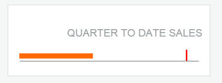

### Line Chart

#### Overview

Next, add a Line chart, a Line chart shows data as continuous lines that pass through points defined by their items' values. It can be useful for showing a trend over time and comparing several sets of similar data. For this example, you'll use a Line chart to show trend data.

#### Exercise: Trigger the Grid DataSource from a DatePicker Event

1. Since changes to the controller are necessary, stop the application if it is running.
1. Use partials to keep the markup tidy. Under `Views/Home`, add a new empty partial view `_MonthlySalesByEmployee.cshtml`.
1. In the new partial `_MonthlySalesByEmployee.cshtml` view, add a new Kendo UI Chart helper.

    	@(Html.Kendo().Chart<KendoQsBoilerplate.MonthlySalesByEmployeeViewModel>()

        )

1. Set the `Name` property to `EmployeeAverageSales`.

        .Name("EmployeeAverageSales")

1. Set the controls height to `30px`.

        .HtmlAttributes(new { style = "height:30px;" })

1. Next, add and define a Series chart with the following properties:

     - Set `Line` to the `EmployeeSales` property on the model.
     - Set the `Width` to `1.5`.
     - Disable markers by setting the `Markers` visible property to `false`.
     - Set the tooltip using a valid [number format](https://docs.telerik.com/kendo-ui/globalization/intl/numberformatting) and enabling its visibility.

    ```
        .Series(series =>
        {
            series.Line(model => model.EmployeeSales)
            .Width(1.5)
            .Markers(m => m.Visible(false))
            .Tooltip(t =>  t.Format("{0:c0}").Visible(true));
        })
    ```

1. Next, add and configure the `CategoryAxis` with a `Date` configuration. Set the Category to the `Date` field of the view model.
1. Since the chart will be a formatted like a [sparkline](https://en.wikipedia.org/wiki/Sparkline), set the `Axis` and `MajorGridLines` `Visible` properties to `false` to disable them.

         .CategoryAxis(ca => ca
             .Date()
             .Categories(model => model.Date)
             .Visible(false)
             .MajorGridLines(m => m.Visible(false))
         )

1. Next, add and configure the `ValueAxis` with a Numeric configuration.
1. Set the `Axis`, `Visible`, and `MajorGridLines` properties to `false` to disable them.

         .ValueAxis(va => va.Numeric()
             .Visible(false)
             .Labels(lab => lab.Visible(false))
             .MajorGridLines(m => m.Visible(false))
          )

1. Also set the `Legend` to `false`.

        .Legend(leg => leg.Visible(false))

1. Configure the `DataSource` by setting `Read` to the action `EmployeeAverageSales` on the `Home` controller.
1. Using the `Data` property, set the value to `getEmployeeFilter` sending filter data back to the `Read` action.
1. Add an `Aggregates` on the DataSource to `Average` the `EmployeeSales`.

        .DataSource(ds => ds
            .Read(read => read.Action("EmployeeAverageSales", "Home")
            .Data("getEmployeeFilter"))
            .Aggregates(a => a.Add(model => model.EmployeeSales).Average())
         )

1. Since the DataSource will be invoked manually, set `AutoBind` to `false`.

        .AutoBind(false)

    The resulting code should be like the one shown in the example below.

        @(Html.Kendo().Chart<KendoQsBoilerplate.MonthlySalesByEmployeeViewModel>()
            .Name("EmployeeAverageSales")
            .HtmlAttributes(new { style = "height:30px;" })
            .Series(series =>
            {
                series.Line(model => model.EmployeeSales)
                .Width(1.5)
                .Markers(m => m.Visible(false))
                .Tooltip(t =>  t.Format("{0:c0}").Visible(true));
            })

            .CategoryAxis(ca => ca
                .Date()
                .Categories(model => model.Date)
                .Visible(false)
                .MajorGridLines(m => m.Visible(false))
            )

            .ValueAxis(va => va.Numeric()
                .Visible(false)
                .Labels(lab => lab.Visible(false))
                .MajorGridLines(m => m.Visible(false))
            )
            .Legend(leg => leg.Visible(false))
            .DataSource(ds => ds
                .Read(read => read.Action("EmployeeAverageSales", "Home")
                .Data("getEmployeeFilter"))
                .Aggregates(a => a.Add(model => model.EmployeeSales).Average())
                )
            .AutoBind(false)
        )

1. Open `controllers/HomeController.cs` and create a controller action named `EmployeeAverageSales` on the `Home` controller. This action will supply the Chart with data.
1. The boilerplate installed in the **Getting Up and Running** chapter has a function named `EmployeeAverageSalesQuery`. This query will select the data required for the chart. Return the results of `EmployeeAverageSalesQuery` as JSON.

    	public ActionResult EmployeeAverageSales(
            int employeeId,
            DateTime statsFrom,
            DateTime statsTo)
        {
            var result = EmployeeAverageSalesQuery(employeeId, statsFrom, statsTo);

            return Json(result, JsonRequestBehavior.AllowGet);
        }

1. Add the partial view to the main application page. In `Views/Home/Index.cshtm` find the `<!-- Montly Sales Chart -->` placeholder.

    	<!-- Montly Sales Chart -->
    	@Html.Placehold(430, 120, "Chart")

1. Replace the placeholder with the `_MonthlySalesByEmployee` partial.

    	<!-- Montly Sales Chart -->
    	@Html.Partial("_MonthlySalesByEmployee")
<!--_-->

1. Find the scripts section and add a new function named `refreshEmployeeAverageSales`. This function will invoke `read` on the chart's data source.

    	<script>
    		...
    	</script>

    The resulting code should be like the one shown in the example below.

    	function refreshEmployeeAverageSales() {
            var employeeAverageSales = $("#EmployeeAverageSales").data("kendoChart");
            employeeAverageSales.dataSource.read();
        }

1. Find and modify the `onCriteriaChange` function so it calls `refreshEmployeeAverageSales` updating the chart's data  when a filter or employee selection is changed.

    	function onCriteriaChange() {
            updateEmployeeAvatar();
            refreshGrid();
            refreshEmployeeQuarterSales();
            refreshEmployeeAverageSales();
        }

1. Run the application to see the chart render on the dashboard. Change the filter criteria to see the chart update along with other UI elements.

    

### Client-Side API

#### Overview

Charts, like other Kendo UI widgets are easy to interact with on the client side. By handling the chart's events additional functionality can be added to the application. Use the `DataBound` event and the `DataSource` to populate values on labels within the Team Efficiency Dashboard.

#### Exercise: Display Chart Values Using Client APIs

1. In `Views/Home/Index.cshtm`, find the scripts section.

    	<script>
    		...
    	</script>

1. Add a function named `onQuarterSalesDataBound`, find the first element of the datasource and displays the Current value in `EmployeeQuarterSalesLabel`.

        function onQuarterSalesDataBound(e) {
            var data = this.dataSource.at(0);
            $("#EmployeeQuarterSalesLabel").text(kendo.toString(data.Current, "c2"));
        }

1. Add a function named `onAverageSalesDataBound` find the `dataSource` aggregates and display the average of `EmployeeSales` in the `EmployeeAverageSalesLabel`.

    	function onAverageSalesDataBound(e) {
            var label = $("#EmployeeAverageSalesLabel"),
                data = this.dataSource.aggregates()

            if (data.EmployeeSales) {
                label.text(kendo.toString(data.EmployeeSales.average, "c2"));
            } else {
                label.text(kendo.toString(0, "c2"));
            }
        }

1. Open the partial view `_MonthlySalesByEmployee.cshtml` and add a `DataBound` event handler to the chart, set the event handler to `onQuarterSalesDataBound`.

        @(Html.Kendo().Chart<KendoQsBoilerplate.MonthlySalesByEmployeeViewModel>()
            ...
    	    .AutoBind(false)
            .Events(e => e.DataBound("onAverageSalesDataBound"))
    	)

1. Open the partial view `_QuarterToDateSales.cshtml` and add a `DataBound` event handler to the chart. Set the event handler to `onQuarterSalesDataBound`.

        @(Html.Kendo().Chart<KendoQsBoilerplate.QuarterToDateSalesViewModel>()
            ...
            .AutoBind(false)
            .Events(e => e.DataBound("onQuarterSalesDataBound"))
        )

    

The Team Efficiency Dashboard is starting to look complete, but it hasn't been tested for devices like mobile phones or tablets yet. In the next chapter you'll use responsive web design techniques to support devices beyond the desktop.

## Go Responsive

In this chapter you'll learn how to make the dashboard application look amazing on any device size. The Team Efficiency Dashboard layout uses Bootstrap for some basic responsive functionality. However, more detailed controls, such as the Grid, need extra attention to ensure a proper user experience on any device size. In the next few steps you'll take the app from desktop, to anywhere, with a few key changes.

### Responsive Grid

#### Overview

Run the project and shrink the browser window horizontally to about 400 pixels wide. Refresh the browser and observe how the application elements stack nicely, but the grid bleeds off the page. There is simply too much information in the grid to show at this screen size. By setting a few properties we can remove non-essential columns from the grid for small screens.

#### Exercise: Make the Grid Mobile Friendly with Responsive APIs

1. Open `Views/Invoice/Index.cshtml` and find where the `Columns` are defined in the `EmployeeSales` grid.

    	.Columns(columns =>
        {
            ...
        })

    Remove the `Salesperson` column completely. The sales person is already displayed at the top of the page.

1. Set the `MinScreenWidth` of the `CustomerName` column to `900`. This means that the column will no longer be displayed on screen sizes less than 900 pixels wide.
1. Set the `MinScreenWidth` of the `ProductName` column to `768`. This means that the column will no longer be displayed on screen sizes less than 768 pixels wide.

    	.Columns(columns =>
        {
            columns.Bound(c => c.CustomerName).MinScreenWidth(900);
            columns.Bound(c => c.OrderDate).Format("{0:MM/dd/yyyy}");
            columns.Bound(c => c.ProductName).MinScreenWidth(768);
            columns.Bound(c => c.UnitPrice);
            columns.Bound(c => c.Quantity);
        })

1. Refresh the page, then shrink and grow the browser to different widths to see how the grid reacts at various sizes.

    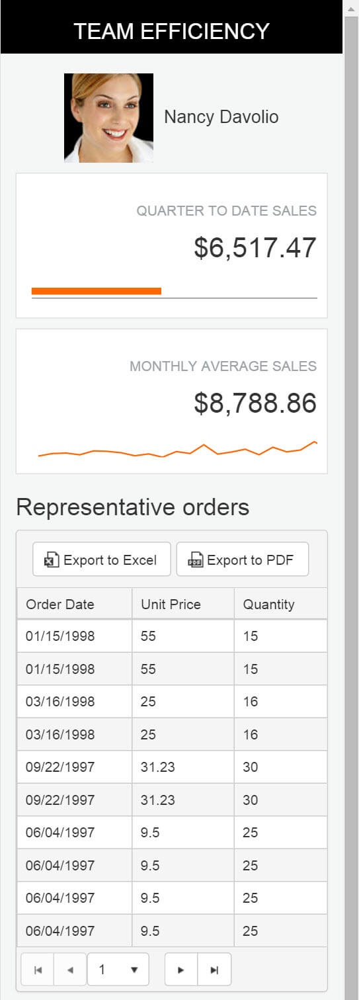

### Responsive Panel

#### Overview

When changing the screen size, you may have noticed the Report Range side bar disappear. If not, take a moment to adjust the browser width again to see the side bar's behavior. Currently, the sidebar is hidden using the [Bootstrap's `hidden-xs` class](https://getbootstrap.com/docs/3.4/css/). Bring back the side bar using a Kendo UI ResponsivePanel and make a seamless user experience on any device size.

#### Exercise: Add a Responsive Panel Side Bar

1. Open `Views/Home/Index.cshtml` and find the `<!-- Menu Panel -->` placeholder. Below the `<!-- Menu Panel -->` placeholder add a `ResponsivePanel`. Set the `Name` to `menuPanel` and set the Breakpoint to `768`.

1. Add a `Content` property and include all of the elements until you reach the ending `<!-- /Menu Panel -->` placeholder.

    > The `at` symbol `@` is used as an escape charter for HTML content.

    The resulting code should be like the one shown in the example below.

    	<!-- Menu Panel -->
    	    @(Html.Kendo().ResponsivePanel().Name("menuPanel").Breakpoint(768).Content(
    	    @<div class="hidden-xs" style="float:left;">
                ...
            </div>
        ))
        <!-- /Menu Panel -->

1. Remove `class="hidden-xs" style="float:left;"` from the `div` element in the newly added responsive panel.

    	<!-- Menu Panel -->
    	    @(Html.Kendo().ResponsivePanel().Name("menuPanel").Breakpoint(768).Content(
    	    @<div>
                ...
            </div>
        ))
        <!-- /Menu Panel -->

1. Next, add a button for users to tap and toggle the responsive panel.
1. Find the block of code shown in the example below.

    	<section id="app-title-bar" class="row">
    	    <div class="col-sm-3">
    	        <h1 class="title">@ViewBag.Title</h1>
    	    </div>
    	</section>

    After the section's closing tag `</section>`, add a new `div` with a `class` of `hamburger`.

1. Inside the hamburger `div`, create a Kendo UI Button. Set the following button's properties:

    - `Name: menuPanelOpen`
    - `Content: menu`
    - `Icon: more-horizontal`
    - `HtmlAttributes: new { @class = "k-rpanel-toggle" }`

    > Any element with the `k-rpanel-toggle` class will be able to toggle the current page's responsive panel.

    	<div class="hamburger">
    	    <!-- toggle button for responsive panel, hidden on large screens -->
    	    @(Html.Kendo().Button()
    	                .Name("menuPanelOpen")
    	                .Content("menu")
    	                .Icon("more-horizontal")
    	                .HtmlAttributes(new { @class = "k-rpanel-toggle" })
    	    )
    	</div>

1. Open `Content/Site.css` and find the `/* Top Bar */` placeholder.

    	/* Top Bar */

<!--*-->
1. Add a style that selects the `hamburger` element and sets the `position` to `absolute`. Give the style a `top` of `5` and `left` of `5` to create a margin around the element.

    	.hamburger {
    	    position: absolute;
    	    top: 5px;
    	    left: 5px;
    	}

1. Add a style that selects the `menuPanel`. Set a solid background color of `#fff` (white), include a `padding` of `10px` and `z-index` of `3`. This style will ensure that the panel appears above other UI elements and has a solid background.

    	#menuPanel {
    	    background-color: #fff;
    	    padding: 10px;
    	    z-index: 3;
    	}

1. Run or refresh the application. Expand and contract the browser's width, notice the **Menu** button appear when the browser is small. Click the **Menu** button to open the panel. Click beside the panel to collapse it.
1. For a better user experience, add a **Close** button to the panel so the interaction is discoverable and intuitive.
1. Find the `menuPanel` and add a Kendo UI Button inside the Content's first `div`. Set the following button's properties:

    - `Name: menuPanelClose`
    - `Content: Close`
    - `Icon: close`
    - `HtmlAttributes: new { @class = "k-rpanel-toggle" }``

1. Wrap the button in a `div` with a class of `text-right` to position the button on the right hand edge of the panel.

    	@(Html.Kendo().ResponsivePanel().Name("menuPanel").Breakpoint(768).Content(
        @<div>
            <div class="text-right">
                @(Html.Kendo().Button()
                   .Name("menuPanelClose")
                   .Content("Close")
                   .Icon("close")
                   .HtmlAttributes(new { @class = "k-rpanel-toggle" })
                )
            </div>
            ...
         </div>

1. Refresh the application. Expand and contract the browser's width until the **Menu** button is shown. Toggle the responsive panel using the **Menu** and **Close** buttons.

    

The application is almost complete, just apply a nice bright theme and it will be ready to ship.

## Kendo UI Themes

Kendo UI widgets include a number of predefined themes. In this chapter you'll learn how to make your app look amazing using Kendo UI themes.

### Theme Change

#### Exercise: Theme the Application

1. If running, stop the project.
1. In the Visual Studio's Project Explorer, right-click the project and choose **Telerik UI For MVC** > **Configure Project** from the menu.
1. From the Project Configuration Wizard, choose the Nova theme.
1. Open `Views/Shared/_Layout.cshtml` and move `@Styles.Render("~/Content/css")` just above the closing head tag `</head>`.
1. Run the application to see the theme applied to the Kendo UI widgets.
1. Next, you'll be finishing the theme by adding styles to non-Kendo UI elements creating a completely custom look. A style sheet was installed with the boilerplate to give you a jump-start. Add it to the application by opening `Views/Shared/_Layout.cshtml` and adding a reference to `~/Content/site-nova.css` just above the closing head tag `</head>`.

    > This is CSS, so the order in which the style sheets are added is very important.

        <link href="~/Content/site-nova.css" rel="stylesheet" />
	</head>

1. Refresh the application and notice the look is starting to come together. There's just a few items that could use some fine-tuning. Let's add some additional styles to `site-nova.css` to complete the theme.
1. Open `site-nova.css` and find the `/* Side Panel - Employee List */`. Add a style that sets the date picker widgets inside the `menuPanel` to 100% width of the container.

    The resulting code should be like the one shown in the example below.

    	/* Side Panel - Employee List */
    	#menuPanel .k-widget.k-datepicker {
    	    width: 100%;
    	}

    <!--*-->
    

1. Add a style to offset the employee list so its content lines up with the left edge of its container.

    	#employee-list > ul {
        	margin: 0 -10px;
    	}

    

1. Find `/* Small Devices, Tablets, and Up */`. Here you'll find a media query that will hold some styles that are only applied to scree sizes above `768px`.

    	@media only screen and (min-width : 768px) {

    	}

1. Inside the media query, add a selector for `.app-wrapper` and set a left margin of `-15` and set the `position` to `relative`. This style will align the app with the left hand edge of the screen.

    	/* Small Devices, Tablets, and Up */
    	@media only screen and (min-width : 768px) {
    	    .app-wrapper {
    	        position: relative;
    	        margin-left: -15px;
    	    }
    	}

    <!--*-->
    

1. Finally, set the Kendo UI Chart themes. Open `_MontlySalesByEmployee.cshtml` and set the `Theme` property to `nova` on the `EmployeeAverageSales` chart.

    	@(Html.Kendo().Chart<KendoQsBoilerplate.MonthlySalesByEmployeeViewModel>()
            .Name("EmployeeAverageSales")
            ...
            .AutoBind(false)
           	.Events(e => e.DataBound("onAverageSalesDataBound"))
            .Theme("nova")
    	)

1. Open `_QuarterToDateSales.cshtml` and set the `Theme` property to `nova` on the `EmployeeQuarterSales` chart.

        @(Html.Kendo().Chart<KendoQsBoilerplate.QuarterToDateSalesViewModel>()
            .Name("EmployeeQuarterSales")
            ...
    	    .AutoBind(false)
            .Events(e => e.DataBound("onQuarterSalesDataBound"))
            .Theme("nova")
    	)

And... that's it! You've created an interactive dashboard application using Telerik UI for MVC and Kendo UI. In the process you've mastered scaffolding, Kendo UI templates, charts, server and client-side APIs, responsive web design and themes.

Congratulations!

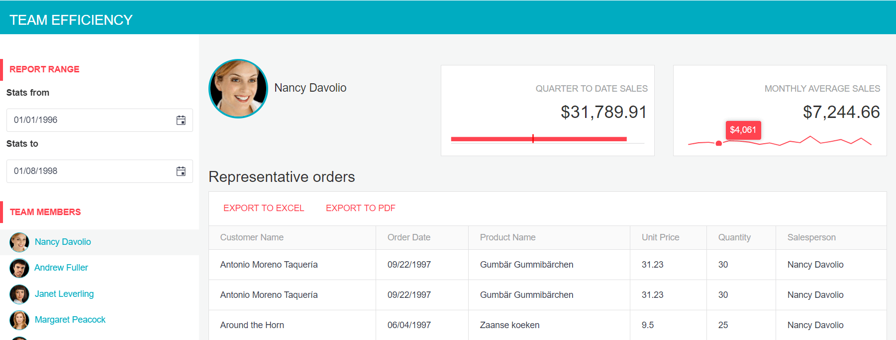

## Next Steps

Your journey with Telerik is just beginning. Here are some resources to help you figure out where to go from here.

- Follow [@telerik](https://twitter.com/telerik) on Twitter for the latest and greatest news about Telerik UIs.
- Check out the [Telerik UI for ASP.NET MVC roadmap](https://www.telerik.com/support/whats-new/aspnet-mvc) to see what's coming next.
- Find comprehensive [demos of individual widgets and complete applications](https://demos.telerik.com/aspnet-mvc/).
