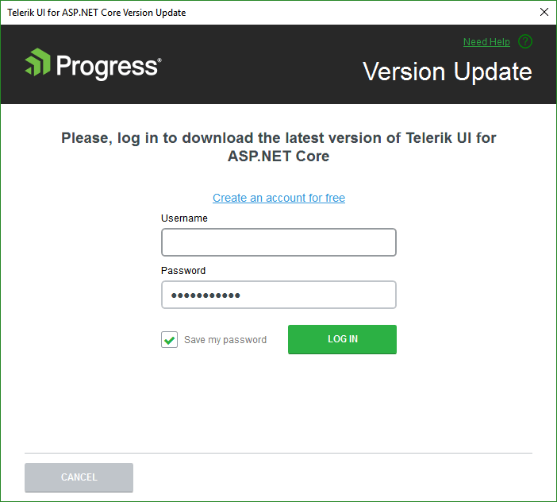
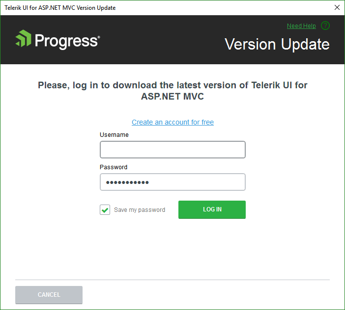
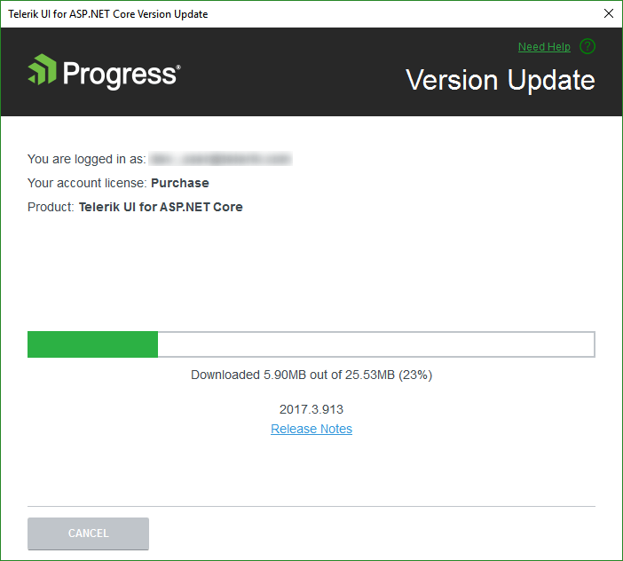
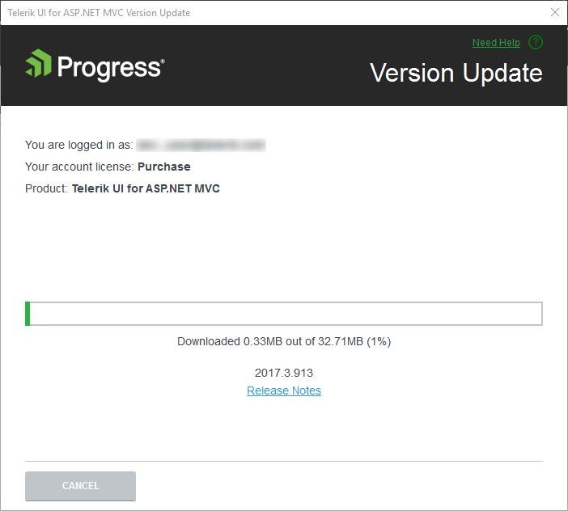
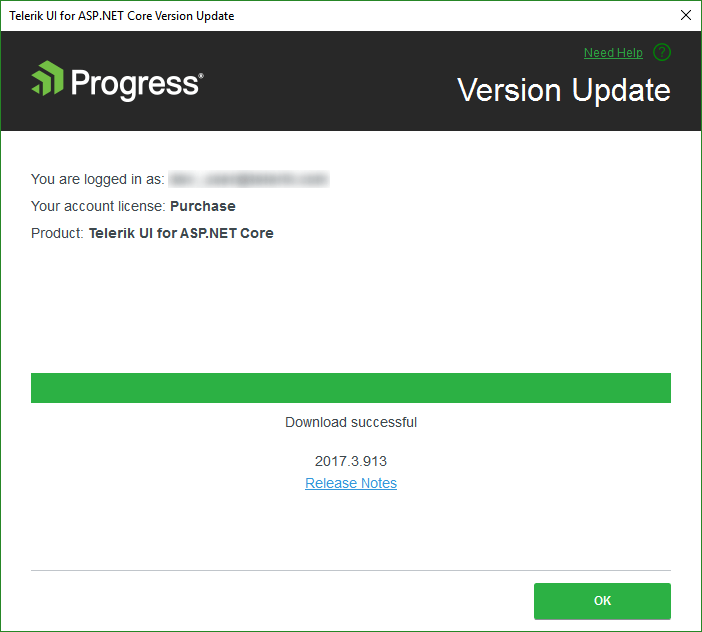
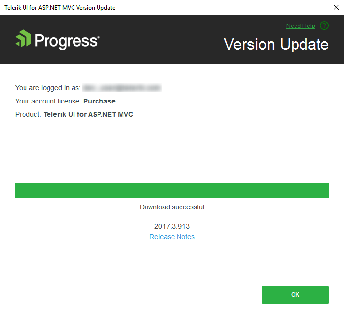

# Downloading New Versions

The {{ site.product }} Visual Studio (VS) extensions enable you to keep your projects updated.

## Latest Version Acquirer Tool

The Latest Version Acquirer tool automatically retrieves the latest {{ site.product }} distribution which is available on the Telerik website. Once a day, upon loading a project with {{ site.product }} controls, the extensions query the Telerik website for a new version of the components. When a new version is detected, you receive a notification.







> If you disable the notifications, you can use the **Options** dialog to activate them again.

Clicking **Update Now** starts the Latest Version Acquirer tool, which prompts for your Telerik credentials on its first page. If you do not have a [www.telerik.com](https://www.telerik.com) account, you can create one through the **Create an account for free** link.







> The Latest Version Acquirer is not available with the trial license. Attempting to download a distribution results in an error message.

## The Download Process

1. Go to the [release notes of the {{ site.product }} distribution](https://www.telerik.com/support/whats-new/aspnet-core-ui/release-history) to get information on the latest available versions.
1. Optionally, select the **Save my password** checkbox. The credentials are saved securely in a per-user context. Other users on the machine do not have access to your stored credentials.
1. In the dialog that appears, confirm the download.


    

    


    As a result, the latest version automatically starts to download.


    

    


1. Click **OK** when the download process of the latest version completes.


    

    


1. To access the latest version of {{ site.product }} after the download completes, go to **New Project Wizard**.

    > * The **Download** buttons of the **New Project Wizard** launch the **Latest Version Acquirer** tool.
    > * The **Latest Version Acquirer** tool downloads the `.zip` files which contain the latest Telerik UI for ASP.NET Core binaries and any resources that are vital for a Telerik UI for ASP.NET Core application. These get unpacked in the `%APPDATA%\Telerik\Updates` folder by default. If you find the list of the offered packages too long and you do not need the older versions, close the VS and use the Windows Explorer to delete these distributions.

## See Also

* [Integrating Visual Studio in Your .Net Project (Overview)]()
* [Creating New Telerik Projects with Visual Studio]()
