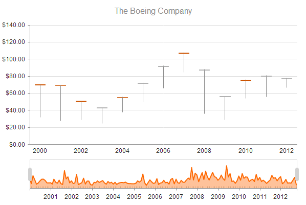

# {{ site.product }} StockChart Overview

The StockChart is a specialized control visualizing the price movement of any financial instrument over a certain period of time.

StockCharts include extensive touch support and a navigator pane for easy browsing of extended time periods. Generally, StockCharts extend the Kendo UI Chart widget and share most of its features.

All of the following series types that are supported by the StockChart are also accessible from a Kendo UI Chart widget:

* [Candlestick](https://en.wikipedia.org/wiki/Candlestick_chart)
* [Open-high-low-close (OHLC)](https://en.wikipedia.org/wiki/Open-high-low-close_chart)
* Column
* Line
* Area

* [Demo page for the StockChart](https://demos.telerik.com/kendo-ui/financial/index)

## Basic Configuration

To create a StockChart, add an empty `div` to the HTML and provide it with an ID. Optionally, set the width and height of the desired chart inline or by using CSS.

    

To render the StockChart, select the `div` with a jQuery selector and call the `kendoStockChart()` function.

    $("#stockChart").kendoStockChart({
		// Options.
    });

You can add a title to the StockChart by specifying the `text` property of the `title` object.

    $("#stockChart").kendoStockChart({
        title: {
             text: "The Boeing Company"
        }
    });

Each data point has to have an associated date. The StockChart supports the following date field values:

* A `Date` instance
* A string that can be parsed by `new Date([field value])`
* A string in an ASP.NET JSON format, for example, `"\/Date(1320825600000-0800)\/"`

> You need to sort the data points by date in ascending order. Therefore, sort the data on the server or use the [`sort`](/api/framework/datasource#sort-array--objectdefault) option of the DataSource.

To specify the name of the field, use the `dateField` option. If the field name is the default `"date"` value, you can omit this field name.

    $("#stockChart").kendoStockChart({
		dateField: "SampleDate"
		...
    });

The navigator pane of the StockChart has its own set of series. They share the same syntax and are bound to the data source of the StockChart.

    $("#stockChart").kendoStockChart({
		...
		navigator: {
	    	series: [{
     	   		type: "area",
     	   		field: "Volume"
			}, {
				type: "line",
				field: "ExpectedVolume"
			}]
		}
    });

If you define a single series, you can omit the array.

    $("#stockChart").kendoStockChart({
		...
		navigator: {
	    	series: {
     	   		type: "area",
     	   		field: "Volume"
			}
		}
    });

## Functionality and Features

The StockChart provides options for [binding it to data]().

## See Also

* [Basic Usage of the StockChart (Demo)](https://demos.telerik.com/kendo-ui/financial/index)
* [JavaScript API Reference of the StockChart](/api/javascript/dataviz/ui/stock-chart)
