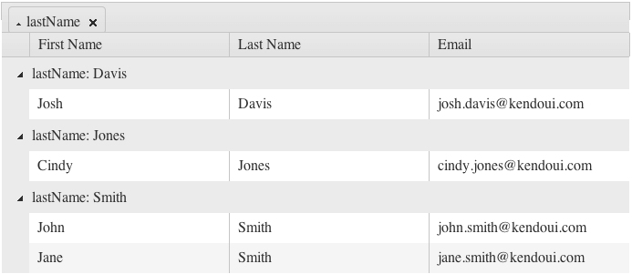

# Grouping Overview

By default, the grouping functionality of the Grid is disabled.

For more information on displaying aggregate results, refer to the article on [grouping with aggregates]().

## Getting Started

To enable grouping, set the `groupable` option to `true`. As a result, the Grid exposes a new area in its header which enables the user to group the Grid data by a column. To group the data by multiple columns, users can drag the desired columns to the grouping header.

    $("#grid").kendoGrid({
         groupable: true
         // Other configuration.
    });

To sort the grouped content, click the grouping tab. To toggle the sort order of the grouped data from the previous example, click **Last Name**. Each individual group can also be toggled from their expanded to collapsed state by clicking the arrow next to the respective header grouping.

**Figure 1: A Grid with its grouping functionality enabled**

**Figure 2: A Grid with its data grouped by last name**

> Only columns that are [bound to a field](https://docs.telerik.com/kendo-ui/api/javascript/ui/grid/configuration/columns.field) can be groupable. To enable grouping on a column bound to an object, [bind the column to a field of that object](https://docs.telerik.com/kendo-ui/knowledge-base/enable-operations-for-object-column).

## Using with Row Templates

A row template explicitly defines the row markup while grouping requires you to change the row markup. To use the two features simultaneously, include a script in the row template which adds additional cells depending on the number of the existing groups.

    $(document).ready(function () {
        // window. can be omitted if the function is defined outside the document.ready closure.
        window.getGridGroupCells = function(id) {
            var cnt = $("#" + id).data("kendoGrid").dataSource.group().length,
                result = "";

            for (var j = 0; j < cnt; j++) {
                result += "<td class='k-group-cell'>&nbsp;</td>";
            }

            return result;
        }

        $("#GridID").kendoGrid({
            groupable: true,
            rowTemplate: "<tr>" +
                "#= getGridGroupCells('GridID') #" +
                "<td>...</td><td>...</td><td>...</td></tr>",
            altRowTemplate: "<tr class='k-alt'>" +
                "#= getGridGroupCells('GridID') #" +
                "<td>...</td><td>...</td><td>...</td></tr>"
        });
    });

## Using with Paging

When you use grouping with paging, paging occurs before grouping. As a result:
* The `dataSource` instance is not aware if items from the displayed groups are available on other pages.
* If the groups are collapsed, you cannot display additional items and groups from other pages after the rendered items and groups. To work around this issue, increase the page size.

To enable the Grid to execute grouping before paging, group the whole data source. In this case, however, the performance of the Grid will be reduced.

## Hiding Grouped Column

As of R3 2022, the Kendo UI Grid enables the developer to hide grouped columns from the Grid. This feature prevents the duplication of data in both the Grid and the group header.

To allow automatic hiding of a grouped column, set the [`columns.hideOnGroup`](/api/javascript/ui/grid/configuration/columns.hideongroup property to **true**.

## KB Articles on Grouping

* [Enable Grouping for Columns Bound to Complex Object]()
* [Persisting the Collapsed State of Grouped Records]()
* [Changing the Group Header Position When Columns Are Locked]()
* [Find Out More in the Knowledge Base](/knowledge-base)

## See Also

* [JavaScript API Reference of the Grid](/api/javascript/ui/grid)
