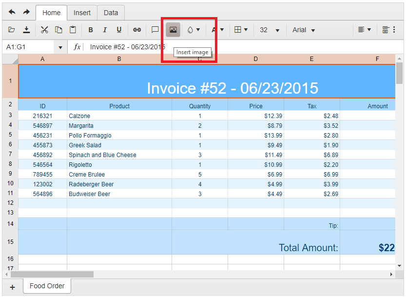

# Images

The Spreadsheet supports the placing of images in its sheets.

To load an image to a sheet, use any of the following approaches:

* Use the Insert Image tool available on the Spreadsheet toolbar.
* Use the initial configuration of the Spreadsheet to load and point to the widget.
* Use the `sheet.addImage()` API method.

## Using the Insert Image Tool

You can upload and insert a custom image in the Spreadsheet with the `Insert Image` tool.



Then, in the popup window, you can select or drag in a file from the file system.


## Configuring the Spreadsheet to Initially Display an Image

1. To properly configure the Spreadsheet to display an image on one its sheets, add a definition for the image to the Spreadsheet [`images`](/api/javascript/ui/spreadsheet/configuration/images) field. In the `images` object each image should be specified with unique key (property name) holding as value the image URL. The image URLs can be either [data URLs](https://developer.mozilla.org/en-US/docs/Web/HTTP/Basics_of_HTTP/Data_URIs), in which case the images are fully contained in the definition, or can be external URLs.

    ```
        images: {
            testImage: "../images/1.jpg"
        }
    ```

1. Reference that image and place it accordingly using the [`drawings`](/api/javascript/ui/spreadsheet/configuration/sheets.drawings) array of the respective sheet.

  The drawing definition has to contain:

      * A pointer to the cell that will hold the top-left corner of the image: `topLeftCell: "J6"`.
      * X and Y offset of the top-left corner: `offsetX: 30, offsetY: 10`.
      * Dimensions of the rendered image: `width: 320, height: 220`.
      * A pointer to the image key that is used in the `images` configuration of the Spreadsheet: `image: "testImage"`.

The following example demonstrates how to configure the Spreadsheet to display an image with top-left corner placed in the `J6` cell.

```dojo
    <div id="spreadsheet"></div>

    <script>
        $("#spreadsheet").kendoSpreadsheet({
            sheets: [{
                drawings: [{
                    topLeftCell: "J6",
                    offsetX: 30,
                    offsetY: 10,
                    width: 320,
                    height: 220,
                    image: "testImage"
                }]
            }],
            images: {
                testImage: "../images/1.jpg"
            }
        })
    </script>
```

## Using the addImage() Method

The Spreadsheet Sheet API exposes a method that allows you to programmatically add an image to the Spreadsheet and place it on a sheet.

1. Create a new `kendo.spreadsheet.Drawing` object. The configuration of the `Drawing` object is the same as the one described in the example from the previous section.
1. Pass the `Drawing` to the [`sheet.addDrawing()`](/api/javascript/spreadsheet/sheet/methods/adddrawing).

    > When you use the export functionality of the Spreadsheet together with images, note the following:
    > * Images are supported only for client-side import and export. When you engage server-side import or export, no images will be loaded or exported.
    > * To properly export any image to PDF by using the default Spreadsheet functionality, at least one cell with data has to be present on the sheet which contains that image.

    ```dojo
        <div id="spreadsheet"></div>

        <script>
            var spreadsheet = $("#spreadsheet").kendoSpreadsheet({
                sheets: [{
                    drawings: [{
                        topLeftCell: "J6",
                        offsetX: 30,
                        offsetY: 10,
                        width: 320,
                        height: 220,
                        image: "testImage"
                    }]
                }],
                images: {
                    testImage: "../images/1.jpg"
                }
            }).data("kendoSpreadsheet");

            var sheet = spreadsheet.activeSheet();

            var drawing = kendo.spreadsheet.Drawing.fromJSON({
                topLeftCell: "J6",
                offsetX: 30,
                offsetY: 10,
                width: 320,
                height: 220,
                image: spreadsheet.addImage("../images/1.jpg")
            });

            sheet.addDrawing(drawing);
        </script>
    ```

## See Also

* [Adding Images to the Spreadsheet (Demo)](https://demos.telerik.com/kendo-ui/spreadsheet/images)
* [Spreadsheet JavaScript API Reference](/api/javascript/ui/spreadsheet)
