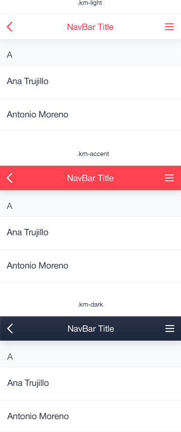

# NavBar Overview

The [Hybrid UI NavBar widget](https://demos.telerik.com/kendo-ui/m/index#navbar/index) is used inside a mobile View or Layout `header` element to display an application navigation bar. The mobile NavBar may display the current view title in the center, and optionally some additional left- and right-aligned widgets&mdash;a back button, settings button, etc.

## Getting Started

The Kendo UI mobile Application automatically initializes a mobile NavBar for every element with the `role` data attribute set to `navbar` and present in the views/layouts markup. Alternatively, it can be initialized using jQuery plugin syntax in the containing mobile View `init` event handler.

### Initialize from Markup

The example below demonstrates how to initialize the Hybrid UI NavBar from markup.


```dojo
    <div data-role="view" data-title="Hello world">
        <div data-role="header">
            <div data-role="navbar">
                <span data-role="view-title"></span>
            </div>
        </div>
    </div>
    <script>
        new kendo.mobile.Application();
    </script>
```

### Initialize Using jQuery

The example below demonstrates how to initialize the Hybrid UI by using jQuery plugin syntax.


    var navbar = $("#navbar").kendoMobileNavBar();

## Layout and Appearance

### Customize Background Colors

The Hybrid UI NavBar background color can be customized by setting its background-color CSS property either inline or using a CSS selector with specificity of 20+. Different platforms can be styled separately with their respective root classes.

The example below demonstrates how to create a green Hybrid UI NavBar.


    <div data-role="navbar" style="background-color: green">My View Title</div>

The example below demonstrates how to create a green Hybrid UI NavBar in iOS and a red one in Android.


    <style>
        .km-ios .checkout { background-color: green; }
        .km-android .checkout { background-color: red; }
    </style>

    <div data-role="navbar" class="checkout">My View Title</div>

### Align Widgets inside NavBar

After initialization, the mobile NavBar positions its child elements based on the specified `align` data attribute&mdash;either `left` or `right`. By default, elements without any `align` parameter are centered.

The example below demonstrates how to use the `align` data attribute to specify the elements position inside the NavBar.


    <div data-role="navbar">
        <a data-role="backbutton" data-align="left">Back</a>
        My View Title
        <a data-role="button" data-align="right">About</a>
    </div>

### Show Hidden View Titles

By default, the NavBar view title is visible only in iOS and is hidden in the rest of the platforms. Apply the CSS demonstrated in the example below to make it visible on a specific platform such as Android.


    .km-android .km-navbar .km-view-title /* Before Q2 2012 SP1 */
    {
        display: inline-block;
    }
      .km-android .km-navbar .km-view-title /* After Q2 2012 SP1 */
    {
        visibility: visible;
    }

<!--*-->
### Update NavBar Titles from Current View Titles Automatically

If an element with the `role` data attribute set to `view-title` is present inside the mobile NavBar, the mobile Kendo UI Application instance updates its text to the current View's title when changing views. Note that the element itself should not contain any text&mdash;it is going to be removed automatically. The View title is specified by setting the `title` data attribute of the View element.

This feature is particularly useful if the NavBar is inside a layout.

> **Important**
>
> The NavBar automatically hides itself if the containing view does not have a view title and the NavBar hosts a span with the `data-role=view-title` attribute.

### Update NavBar Titles from Data Attributes Automatically

The example below demonstrates how to use the `view-title` data attribute to auto-update the NavBar title.


    <div data-role="layout" data-id="foo">
        <div data-role="header">
            <div data-role="navbar">
               <span data-role="view-title">My View Title</span>
            </div>
        </div>
    </div>

    <div data-role="view" data-layout="foo" data-title="bar"> ... </div>
    <div data-role="view" data-layout="foo" data-title="baz"> ... </div>

## Nova Theme Features

### Color Schemes

**Figure 1: Different color schemes of the NavBar**



There are three predefined color schemes&mdash;light, dark (default), and accent. To apply color schemes different than the default one, set the `km-light` or the `km-accent` class.

The example below demonstrates how to set the `km-light` class in the NavBar.


     <header data-role="header">
        <div data-role="navbar" class="km-light">
            <!-- ... -->
        </div>
    </header>

The example below demonstrates how to set the `km-accent` class in the NavBar.


     <header data-role="header">
        <div data-role="navbar" class="km-accent">
            <!-- ... -->
        </div>
    </header>

### Subtitles

To activate the subtitles, add a `span` element with the `km-view-subtitle` class to the NavBar, as demonstrated in the example below.


     <header data-role="header">
        <div data-role="navbar">
            <!-- ... -->
            <span class="km-view-subtitle">Subtitle</span>
            <!-- ... -->
        </div>
    </header>

### Nested ButtonGroup

To nest a ButtonGroup, set the `km-navbar-buttongroup` class and add the ButtonGroup component to the NavBar, as demonstrated in the example below.


     <div data-role="navbar" class="km-navbar-buttongroup">
           <!-- ... -->
           <ul data-role="buttongroup" data-index="0">
               <li>
                   By Name
               </li>
               <li>
                   By Family
               </li>
           </ul>
      </div>

## See Also

* [Hybrid UI NavBar JavaScript API Reference](/api/javascript/mobile/ui/navbar)
* [Overview of the Hybrid UI Components]()
* [How to Create Fixed Content Areas with Scroller]()
* [How to Create Relative Content Size Using Flexboxes]()
* [How to Select Value from Another View]()
* [How to Set Initial View Prior to Initialization in AngularJS]()
