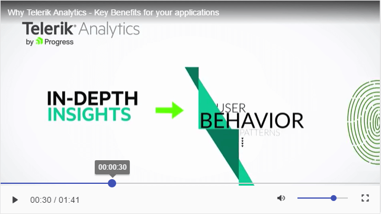

# {{ site.product }} MediaPlayer Overview

The MediaPlayer plays video files from static sources or streams online YouTube videos and enriches your website with dynamic content in a user-friendly interface.

The MediaPlayer also provides a styled video UI functionality by using the HTML5 `<video>` element and brings powerful media capabilities to your applications without the necessity of installing additional plug-ins. It delivers tight integration with the YouTube media provider, rich media web experience for websites, blogs, online TV channels, e-commerce pages, and others, and enables the integration of Kendo UI widgets. In addition to the consistent and elegant built-in skins, the MediaPlayer possesses the main feature of every Kendo UI widget&mdash;it is a useful and convenient tool designed for achieving fascinating results in a sharp time frame.

To respond to cutting-end design practices and trends, the MediaPlayer component provides a responsive layout. This means that its size adapts depending on the capabilities of the client (end user) device and browser. The component automatically resizes its area to display the video in the most suitable possible way within the provided dimensions. The responsive web design of the MediaPlayer is shipped out-of-the-box and intends to save you time and efforts when developing your responsive applications.

* [Demo page for the MediaPlayer](https://demos.telerik.com/kendo-ui/mediaplayer/index)

The following image demonstrates a template of the MediaPlayer.



## Initializing the MediaPlayer

When using local sources, consider the video formats that are supported by the different browsers. For more information on the current supported HTML5 video formats, refer to [this article](http://www.w3schools.com/html/html5_video.asp). Once your video files are ready, initialize the MediaPlayer by using the `div` element.

The following example uses the `autoPlay` property:
* Because of the [mobile considerations](https://developers.google.com/youtube/iframe_api_reference#Mobile_considerations), browsers on iOS do not automatically play embedded media. This limitation prevents unsolicited downloads over cellular networks at the expense of the user. The user always has to initiate a playback. For more information, refer to the article on [audio and video HTML](https://developer.apple.com/library/safari/documentation/AudioVideo/Conceptual/Using_HTML5_Audio_Video/AudioandVideoTagBasics/AudioandVideoTagBasics.html).
* Other functionalities may also be limited due to iOS restrictions. For more information, refer to [this article](http://blog.millermedeiros.com/unsolved-html5-video-issues-on-ios/) and to other available resources on the Web.

```dojo
<div id="mediaplayer1" style="width:640px; height: 360px;"></div>
<script>
    $("#mediaplayer1").kendoMediaPlayer({
        autoPlay: true,
        media: {
            title: "Our Company Culture - Lesson 1",
            source: "Video/video1.mp4"
        }
    });
</script>
```

## Functionality and Features

* [Multiple sources]()
* [Playlists]()
* [Globalization]()
* [Accessibility]()

## Referencing Existing Instances

To refer to an existing MediaPlayer instance, use the `.data()` jQuery method which is executed by the jQuery object of the originating element. Once a reference is established, use the [MediaPlayer API](/api/javascript/ui/mediaplayer#methods) to control its behavior.

```dojo
<button onclick="buttonClick();">Pause Video</button>
<div id="mediaplayer1" style="width:640px; height: 360px;"></div>
<script>
    $("#mediaplayer1").kendoMediaPlayer({
        autoPlay: true,
        media: {
            title: "Our Company Culture - Lesson 1",
            source: "Video/video1.mp4"
        }
    });
    function buttonClick() {
        var player = $("#mediaplayer1").data("kendoMediaPlayer");
        player.pause();
    }
</script>
```

## See Also

* [Basic Usage of the MediaPlayer (Demo)](https://demos.telerik.com/kendo-ui/mediaplayer/index)
* [Using the API of the MediaPlayer (Demo)](https://demos.telerik.com/kendo-ui/mediaplayer/api)
* [JavaScript API Reference of the MediaPlayer](/api/javascript/ui/mediaplayer)
