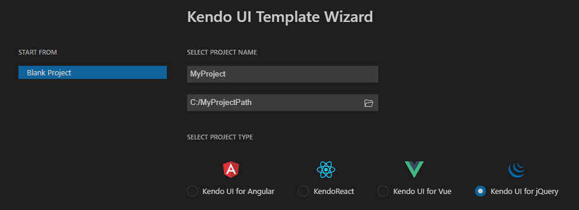

# Kendo UI Productivity Tools for Visual Studio Code

The **Kendo UI Productivity Tools for Visual Studio Code** is an extension for <a href="https://code.visualstudio.com/" target="_blank">Visual Studio Code</a> that enhances the application development experience with Kendo UI for jQuery.

As its primary advantage, the VS Code extension facilitates the creation of projects through a wizard directly in Visual Studio Code.

## 1. Get the Extension

You can get the extension in either of the following ways:

* Go to the [Visual Studio Marketplace](https://marketplace.visualstudio.com/items?itemName=KendoUI.kendotemplatewizard).
* In VS Code, open the **Extensions** tab, search for **Kendo UI Productivity Tools**, and click **Install**.

## 2. Create the Kendo UI Project

To create a Kendo UI for jQuery project:

1. Press `Ctrl`+`Shift`+`P` (for Windows or Linux), or `Cmd`+`Shift`+`P` (on Mac) to open the VSCode extension launcher.
1. Type/Select `Kendo UI Template Wizard: Launch` and press `Enter` to launch the extension.

    

1. Enter a project name and select the location.

    

1. Choose the desired template.

   The Kendo UI Template Wizard for Visual Studio Code comes with several built-in templates for some of the most popular components like Grid, Chart, and Form. These templates allow you to add pages by using the components with a single click. 
   
   Additionally, you can create a **Blank** project and the extensions will generate a page with all of the necessary stylesheets and a single heading element.
   
   

1. Apply the desired styling by selecting a theme.

   To style your application, select one of the built-in [Sass-based themes](https://docs.telerik.com/kendo-ui/styles-and-layout/sass-themes): Default, Bootstrap, or Material.
   
   

1. Click the **Create** button to finish the setup.

1. Run the project:

   1. Install the NPM dependencies by typing `npm install` in the terminal.
   1. Run the application by typing `npm start` in the terminal.

## 3. Check the Project Structure

* The HTML files are located in the `pages` folder of the project. 
* The script files are located in the `src` folder of the project.
* The stylesheets are included in the head element of each individual page.

>The scripts are automatically injected into the HTML pages only if the script name matches the page name. For example, if the page is called `MyPage.html`, then the script file in the `src` folder must be called `MyPage.js`.

## 4. Generate the Snippets

The Kendo UI Productivity Tools for Visual Studio Code extension can generate code snippets with sample configuration for the Kendo UI components. To add a code snippet for a Kendo UI component:

1. Open a `js` file or add a `<script>` tag.
1. Type `kj-short`. Alternatively, type `kj-component`&mdash;where you replace "component" with the name of the desired component, for example, `kj-dropdownlist`.

## See Also

* [First Steps with Kendo UI for jQuery]()
* [Downloading the Bundles]()
* [Using Script License Code]()
